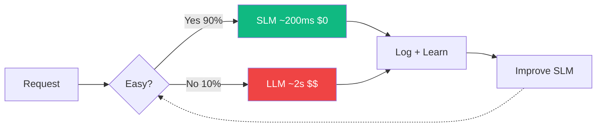

<div style="display: flex; flex-direction: column; align-items: center; justify-content: center; height: 100%; text-align: center;">
  <div style="font-size: 42px; font-weight: 800; letter-spacing: -1.5px; background: linear-gradient(135deg, #f97316, #eab308); -webkit-background-clip: text; -webkit-text-fill-color: transparent; line-height: 1.1;">Small Models, Big Impact</div>
  <div style="color: rgba(255,255,255,0.45); font-size: 16px; margin-top: 12px; letter-spacing: 0.5px;">Why Your Next Production System Doesn't Need a GPT</div>
  <div style="margin-top: 32px; padding: 5px 16px; border-radius: 99px; background: rgba(249,115,22,0.08); border: 1px solid rgba(249,115,22,0.2); color: rgba(249,115,22,0.7); font-size: 11px;">PyConf Hyderabad 2026</div>
  <div style="color: rgba(255,255,255,0.25); font-size: 11px; margin-top: 20px;">Gokulavasan Murali · Head of Engineering, Emma Robots Inc.</div>
</div>

<!--
Open with energy. This is about rethinking how we build AI systems.
-->

---
layout: center
---

<div style="font-size: 24px; font-weight: 800; letter-spacing: -0.5px; background: linear-gradient(135deg, #f97316, #eab308); -webkit-background-clip: text; -webkit-text-fill-color: transparent; text-align: center; margin-bottom: 32px;">Where Are You on the AI Spectrum?</div>

<div style="display: flex; gap: 16px;">

<div style="flex: 1; text-align: center; padding: 20px 12px; border-radius: 10px; border: 1px solid rgba(249,115,22,0.12); background: rgba(249,115,22,0.03); min-height: 140px;">
  <div v-click>
    <mdi-robot-happy style="font-size: 40px; color: #f97316; margin-bottom: 10px;" />
    <div style="font-size: 15px; font-weight: 700; color: rgba(255,255,255,0.8); line-height: 1.4;">Used ChatGPT, Claude or Gemini?</div>
  </div>
</div>

<div style="flex: 1; text-align: center; padding: 20px 12px; border-radius: 10px; border: 1px solid rgba(249,115,22,0.12); background: rgba(249,115,22,0.03); min-height: 140px;">
  <div v-click>
    <mdi-head-cog style="font-size: 40px; color: #eab308; margin-bottom: 10px;" />
    <div style="font-size: 15px; font-weight: 700; color: rgba(255,255,255,0.8); line-height: 1.4;">Tried Llama / Qwen Mistral / Gemma?</div>
  </div>
</div>

<div style="flex: 1; text-align: center; padding: 20px 12px; border-radius: 10px; border: 1px solid rgba(249,115,22,0.12); background: rgba(249,115,22,0.03); min-height: 140px;">
  <div v-click>
    <mdi-code-braces style="font-size: 40px; color: #f97316; margin-bottom: 10px;" />
    <div style="font-size: 15px; font-weight: 700; color: rgba(255,255,255,0.8); line-height: 1.4;">Used an LLM API to build something?</div>
  </div>
</div>

<div style="flex: 1; text-align: center; padding: 20px 12px; border-radius: 10px; border: 1px solid rgba(249,115,22,0.12); background: rgba(249,115,22,0.03); min-height: 140px;">
  <div v-click>
    <mdi-server style="font-size: 40px; color: #eab308; margin-bottom: 10px;" />
    <div style="font-size: 15px; font-weight: 700; color: rgba(255,255,255,0.8); line-height: 1.4;">Deployed a model to production?</div>
  </div>
</div>

</div>

<!--
Gauge the room. Expect most hands on 1, fewer as we go down. This sets up why SLMs matter — most people are stuck at cloud LLMs.
-->

---
layout: default
---

<div style="font-size: 24px; font-weight: 800; letter-spacing: -0.5px; background: linear-gradient(135deg, #f97316, #eab308); -webkit-background-clip: text; -webkit-text-fill-color: transparent;">About Me</div>

<div style="display: flex; gap: 24px; margin-top: 16px;">
  <div style="flex: 1;">
    <div style="display: grid; grid-template-columns: 1fr 1fr; gap: 8px;">
      
      
      
      
    </div>
  </div>
  <div style="flex: 1; display: flex; flex-direction: column; justify-content: center;">
    <div style="font-size: 32px; font-weight: 800; color: rgba(255,255,255,0.9); letter-spacing: -0.5px;">Gokulavasan Murali</div>
    <div style="display: flex; align-items: center; gap: 10px; margin-top: 12px;">
      <div style="width: 36px; height: 2px; background: linear-gradient(90deg, #f97316, #eab308);" />
      <div style="font-size: 15px; color: #f97316;">Head of Engineering @ Emma Robots</div>
    </div>
    <div style="margin-top: 20px; font-size: 14px; line-height: 1.8; color: rgba(255,255,255,0.5);">
      From edge devices to mobile ML to vision-first RPA — building systems where "just add GPUs" was never an option.
    </div>
  </div>
</div>

<!--
Decade long exp in building ML/AL products under constrained embedded compute where GPU was a luxury.
 Autonomous underwater vehicles, rovers
- Among the first to deploy TF Lite models on App Store and Play Store: not just object detection but 3D reconstruction models for logistics


- Autonomous underwater vehicles, rovers
- Among the first to deploy TF Lite models on App Store and Play Store: not just object detection but 3D reconstruction models for logistics
- Plena/Chief: AI Sales Agents, browser-based workflow automation and RPA
- Emma: pioneering Vision-First RPA and Computer Using Agent (CUA) systems
- PyCon India organizer
-->

---
layout: image-right
image: /ferrari-civic.png
backgroundSize: contain
---

<div style="display: flex; flex-direction: column; justify-content: center; height: 100%;">

<v-clicks>

- Your users don't care about parameter counts
- They care about **speed**, **cost**, and **reliability**
- Most AI tasks don't need 400B parameters

</v-clicks>

</div>

<!--
The Ferrari vs Civic analogy. Most production tasks are the Civic — reliable, efficient, gets the job done.
-->

---

<div style="font-size: 24px; font-weight: 800; letter-spacing: -0.5px; background: linear-gradient(135deg, #f97316, #eab308); -webkit-background-clip: text; -webkit-text-fill-color: transparent;">What We'll Cover</div>

<div style="margin-top: 24px; display: flex; flex-direction: column; gap: 12px;">

<div style="display: flex; align-items: center; gap: 14px; padding: 12px 16px; border-radius: 8px; background: linear-gradient(90deg, rgba(239,68,68,0.08), transparent); border-left: 2px solid rgba(239,68,68,0.5);">
  <div style="font-size: 11px; font-weight: 800; color: #ef4444; letter-spacing: 1px; flex-shrink: 0; width: 50px;">01</div>
  <div><div style="color: rgba(255,255,255,0.85); font-size: 15px; font-weight: 700;">The Problem</div><div style="color: rgba(255,255,255,0.35); font-size: 12px; margin-top: 2px;">Why "bigger" isn't always "better" in production</div></div>
</div>

<div style="display: flex; align-items: center; gap: 14px; padding: 12px 16px; border-radius: 8px; background: linear-gradient(90deg, rgba(249,115,22,0.08), transparent); border-left: 2px solid rgba(249,115,22,0.5);">
  <div style="font-size: 11px; font-weight: 800; color: #f97316; letter-spacing: 1px; flex-shrink: 0; width: 50px;">02</div>
  <div><div style="color: rgba(255,255,255,0.85); font-size: 15px; font-weight: 700;">Rise of Small Language Models</div><div style="color: rgba(255,255,255,0.35); font-size: 12px; margin-top: 2px;">What changed in the ecosystem</div></div>
</div>

<div style="display: flex; align-items: center; gap: 14px; padding: 12px 16px; border-radius: 8px; background: linear-gradient(90deg, rgba(16,185,129,0.08), transparent); border-left: 2px solid rgba(16,185,129,0.5);">
  <div style="font-size: 11px; font-weight: 800; color: #10b981; letter-spacing: 1px; flex-shrink: 0; width: 50px;">03</div>
  <div><div style="color: rgba(255,255,255,0.85); font-size: 15px; font-weight: 700;">Demo Time</div><div style="color: rgba(255,255,255,0.35); font-size: 12px; margin-top: 2px;">SLMs doing real work — code gen, PDF parsing, JSON extraction, RPA vision</div></div>
</div>

<div style="display: flex; align-items: center; gap: 14px; padding: 12px 16px; border-radius: 8px; background: linear-gradient(90deg, rgba(234,179,8,0.08), transparent); border-left: 2px solid rgba(234,179,8,0.5);">
  <div style="font-size: 11px; font-weight: 800; color: #eab308; letter-spacing: 1px; flex-shrink: 0; width: 50px;">04</div>
  <div><div style="color: rgba(255,255,255,0.85); font-size: 15px; font-weight: 700;">SLM-First Architecture</div><div style="color: rgba(255,255,255,0.35); font-size: 12px; margin-top: 2px;">The cascade pattern — agentic, enterprise, and pipeline design</div></div>
</div>

<div style="display: flex; align-items: center; gap: 14px; padding: 12px 16px; border-radius: 8px; background: linear-gradient(90deg, rgba(139,92,246,0.08), transparent); border-left: 2px solid rgba(139,92,246,0.5);">
  <div style="font-size: 11px; font-weight: 800; color: #8b5cf6; letter-spacing: 1px; flex-shrink: 0; width: 50px;">05</div>
  <div><div style="color: rgba(255,255,255,0.85); font-size: 15px; font-weight: 700;">Sharp Edges & When NOT to Use SLMs</div><div style="color: rgba(255,255,255,0.35); font-size: 12px; margin-top: 2px;">Limitations, failure modes, and the future of cascades</div></div>
</div>

</div>

---

<div style="display: flex; flex-direction: column; align-items: center; justify-content: center; height: 100%; text-align: center;">
  <div style="font-size: 10px; text-transform: uppercase; letter-spacing: 4px; color: rgba(249,115,22,0.5); margin-bottom: 12px;">Part 01</div>
  <div style="font-size: 32px; font-weight: 800; color: rgba(255,255,255,0.9); letter-spacing: -0.5px;">The Problem</div>
  <div style="width: 40px; height: 2px; background: linear-gradient(90deg, #f97316, #eab308); margin-top: 14px; border-radius: 1px;"></div>
  <div style="color: rgba(255,255,255,0.3); font-size: 14px; margin-top: 12px;">Why "bigger" isn't always "better"</div>
</div>

---

<div style="font-size: 28px; font-weight: 800; letter-spacing: -0.5px; background: linear-gradient(135deg, #f97316, #eab308); -webkit-background-clip: text; -webkit-text-fill-color: transparent;">Today's Architecture</div>

<div style="display: flex; flex-direction: column; align-items: center; gap: 0; margin-top: 28px; position: relative;">

<div style="padding: 12px 36px; border-radius: 8px; background: rgba(249,115,22,0.06); border: 1px solid rgba(249,115,22,0.2); color: rgba(249,115,22,0.8); font-weight: 700; font-size: 15px; letter-spacing: 0.5px;">APPLICATION</div>

<div style="width: 2px; height: 24px; background: linear-gradient(to bottom, rgba(249,115,22,0.3), rgba(239,68,68,0.3));"></div>

<div style="border: 1px dashed rgba(249,115,22,0.15); border-radius: 12px; padding: 24px 36px; position: relative; background: rgba(249,115,22,0.02); display: flex; justify-content: center;">
<div style="position: absolute; top: -9px; left: 50%; transform: translateX(-50%); background: #1a1a2e; padding: 0 12px; font-size: 9px; text-transform: uppercase; letter-spacing: 3px; color: rgba(249,115,22,0.35);">loop until done</div>

<div style="display: flex; align-items: center; gap: 18px;">

<div style="padding: 14px 22px; border-radius: 8px; background: rgba(249,115,22,0.06); border: 1px solid rgba(249,115,22,0.2); text-align: center; min-width: 120px;">
<div style="color: #f97316; font-weight: 700; font-size: 15px;">Prompt</div>
<div style="color: rgba(249,115,22,0.4); font-size: 9px; margin-top: 4px;">tasks · screenshots · context</div>
</div>

<div style="display: flex; align-items: center; gap: 4px;">
<div style="width: 30px; height: 2px; background: rgba(249,115,22,0.2);"></div>
<div style="color: rgba(249,115,22,0.3); font-size: 14px;">▸</div>
</div>

<div style="padding: 16px 28px; border-radius: 10px; background: linear-gradient(135deg, rgba(239,68,68,0.1), rgba(249,115,22,0.05)); border: 1.5px solid rgba(239,68,68,0.25); text-align: center; box-shadow: 0 0 24px rgba(239,68,68,0.08); min-width: 160px;">
<div style="background: linear-gradient(135deg, #ef4444, #f97316); -webkit-background-clip: text; -webkit-text-fill-color: transparent; font-weight: 800; font-size: 20px; letter-spacing: 0.5px;">LLM</div>
<div style="color: rgba(239,68,68,0.35); font-size: 9px; margin-top: 4px;">GPT-4 · Claude · Gemini</div>
</div>

<div style="display: flex; align-items: center; gap: 4px;">
<div style="width: 30px; height: 2px; background: rgba(16,185,129,0.2);"></div>
<div style="color: rgba(16,185,129,0.3); font-size: 14px;">▸</div>
</div>

<div style="padding: 14px 22px; border-radius: 8px; background: rgba(16,185,129,0.06); border: 1px solid rgba(16,185,129,0.2); text-align: center; min-width: 100px;">
<div style="color: #10b981; font-weight: 700; font-size: 15px;">Result</div>
</div>

</div>

<div style="position: absolute; bottom: 8px; right: 16px; font-size: 8px; color: rgba(249,115,22,0.2);">↻ repeat every step</div>
</div>

<div style="width: 2px; height: 24px; background: linear-gradient(to bottom, rgba(16,185,129,0.3), rgba(16,185,129,0.3));"></div>

<div style="padding: 12px 36px; border-radius: 8px; background: rgba(16,185,129,0.06); border: 1px solid rgba(16,185,129,0.2); color: #10b981; font-weight: 700; font-size: 15px; letter-spacing: 0.5px;">RETURN</div>

<div style="margin-top: 24px; display: flex; gap: 24px; justify-content: center;">
<div style="display: flex; align-items: center; gap: 6px;"><div style="width: 7px; height: 7px; border-radius: 50%; background: #ef4444;"></div><span style="font-size: 11px; color: rgba(255,255,255,0.3);">Single point of failure</span></div>
<div style="display: flex; align-items: center; gap: 6px;"><div style="width: 7px; height: 7px; border-radius: 50%; background: #f97316;"></div><span style="font-size: 11px; color: rgba(255,255,255,0.3);">Context bloat per loop</span></div>
<div style="display: flex; align-items: center; gap: 6px;"><div style="width: 7px; height: 7px; border-radius: 50%; background: #eab308;"></div><span style="font-size: 11px; color: rgba(255,255,255,0.3);">Escalating cost</span></div>
</div>

</div>

<!--
Current architecture: single LLM in a loop. Every step sends full context to one massive model.
Cost compounds, latency stacks, single point of failure. This is how most production systems work today.
-->

---

<div style="font-size: 28px; font-weight: 800; letter-spacing: -0.5px; background: linear-gradient(135deg, #f97316, #eab308); -webkit-background-clip: text; -webkit-text-fill-color: transparent; margin-bottom: 12px;">Problems with LLMs</div>

<div style="display: grid; grid-template-columns: 1fr 1fr; gap: 10px;">

<v-click>
<div style="padding: 14px 16px; border-radius: 8px; background: linear-gradient(135deg, rgba(249,115,22,0.08), rgba(234,179,8,0.03)); border: 1px solid rgba(249,115,22,0.15); display: flex; flex-direction: column; justify-content: space-between;">
  <div>
    <div style="background: linear-gradient(135deg, #f97316, #eab308); -webkit-background-clip: text; -webkit-text-fill-color: transparent; font-size: 30px; font-weight: 900; line-height: 1; letter-spacing: -1px;">1s+</div>
    <div style="color: rgba(255,255,255,0.75); font-size: 12px; font-weight: 700; margin-top: 4px;">Latency budgets are brutal</div>
    <div style="color: rgba(255,255,255,0.35); font-size: 9px; line-height: 1.4; margin-top: 4px;">5 sequential tool calls × ~200ms TTFT each — and that's at low load. Under traffic, your p99 looks nothing like your p50.</div>
  </div>
  <div>
    <span style="font-size: 8px; padding: 2px 8px; border-radius: 99px; background: rgba(249,115,22,0.1); color: rgba(249,115,22,0.7); display: inline-block; margin-top: 6px;">Sub-second is now baseline UX expectation</span>
    <div style="font-size: 7px; color: rgba(255,255,255,0.25); margin-top: 3px;">NVIDIA NIM benchmarks + field observation</div>
  </div>
</div>
</v-click>

<v-click>
<div style="padding: 14px 16px; border-radius: 8px; background: linear-gradient(135deg, rgba(139,92,246,0.08), rgba(249,115,22,0.03)); border: 1px solid rgba(139,92,246,0.15); display: flex; flex-direction: column; justify-content: space-between;">
  <div>
    <div style="background: linear-gradient(135deg, #8b5cf6, #f97316); -webkit-background-clip: text; -webkit-text-fill-color: transparent; font-size: 30px; font-weight: 900; line-height: 1; letter-spacing: -1px;">15×</div>
    <div style="color: rgba(255,255,255,0.75); font-size: 12px; font-weight: 700; margin-top: 4px;">Cost compounds fast</div>
    <div style="color: rgba(255,255,255,0.35); font-size: 9px; line-height: 1.4; margin-top: 4px;">Context accumulates across agent steps — by step 5, you're passing 10K tokens even if each reply is short. Retries triple the bill silently.</div>
  </div>
  <div>
    <span style="font-size: 8px; padding: 2px 8px; border-radius: 99px; background: rgba(139,92,246,0.1); color: rgba(139,92,246,0.7); display: inline-block; margin-top: 6px;">$0.025/req × 100K/day = $75K/month</span>
    <div style="font-size: 7px; color: rgba(255,255,255,0.25); margin-top: 3px;">CodeAnt AI, LLM Cost Calculation Guide 2025</div>
  </div>
</div>
</v-click>

<v-click>
<div style="padding: 14px 16px; border-radius: 8px; background: linear-gradient(135deg, rgba(239,68,68,0.08), rgba(249,115,22,0.03)); border: 1px solid rgba(239,68,68,0.15); display: flex; flex-direction: column; justify-content: space-between;">
  <div>
    <div style="background: linear-gradient(135deg, #ef4444, #f97316); -webkit-background-clip: text; -webkit-text-fill-color: transparent; font-size: 30px; font-weight: 900; line-height: 1; letter-spacing: -1px;">77%</div>
    <div style="color: rgba(255,255,255,0.75); font-size: 12px; font-weight: 700; margin-top: 4px;">Data is already leaving your firewall</div>
    <div style="color: rgba(255,255,255,0.35); font-size: 9px; line-height: 1.4; margin-top: 4px;">Source code, client data, internal docs — pasted into personal ChatGPT accounts with zero enterprise visibility. Samsung found out the hard way.</div>
  </div>
  <div>
    <span style="font-size: 8px; padding: 2px 8px; border-radius: 99px; background: rgba(239,68,68,0.1); color: rgba(239,68,68,0.7); display: inline-block; margin-top: 6px;">82% from unmanaged personal accounts</span>
    <div style="font-size: 7px; color: rgba(255,255,255,0.25); margin-top: 3px;">LayerX Enterprise AI & SaaS Security Report 2025</div>
  </div>
</div>
</v-click>

<v-click>
<div style="padding: 14px 16px; border-radius: 8px; background: linear-gradient(135deg, rgba(16,185,129,0.08), rgba(234,179,8,0.03)); border: 1px solid rgba(16,185,129,0.15); display: flex; flex-direction: column; justify-content: space-between;">
  <div>
    <div style="background: linear-gradient(135deg, #10b981, #eab308); -webkit-background-clip: text; -webkit-text-fill-color: transparent; font-size: 30px; font-weight: 900; line-height: 1; letter-spacing: -1px;">~12%</div>
    <div style="color: rgba(255,255,255,0.75); font-size: 12px; font-weight: 700; margin-top: 4px;">JSON breaks in production</div>
    <div style="color: rgba(255,255,255,0.35); font-size: 9px; line-height: 1.4; margin-top: 4px;">Model updates silently change output shape. One malformed response cascades the whole agent chain. Prompt-only enforcement isn't enough.</div>
  </div>
  <div>
    <span style="font-size: 8px; padding: 2px 8px; border-radius: 99px; background: rgba(16,185,129,0.1); color: rgba(16,185,129,0.7); display: inline-block; margin-top: 6px;">Constrained decoding: 95–99% conformance</span>
    <div style="font-size: 7px; color: rgba(255,255,255,0.25); margin-top: 3px;">Han et al., NeurIPS 2023 / JSONSchemaBench 2025</div>
  </div>
</div>
</v-click>

</div>

<!--
Latency: 5 sequential tool calls × ~200ms TTFT each — self-evident math every agent developer has felt.
Cost: $0.025/req × 100K/day = $2,500/day — from published breakdowns. Context accumulates across agent steps.
Privacy: LayerX Enterprise AI Security Report 2025 — 77% paste company data, 82% from personal unmanaged accounts. Samsung source code leak is the canonical example.
Reliability: Han et al. 2023 / JSONSchemaBench 2025 — ~12% invalid JSON for complex schemas (GPT-4, NeurIPS). Basic: 70-90% conformance, with constrained decoding: 95-99%.
The opportunity: Handle 90% of tasks locally and cheaply — escalate only the hard 10%.
-->

---

<div style="display: flex; flex-direction: column; align-items: center; justify-content: center; height: 100%; text-align: center;">
  <div style="font-size: 10px; text-transform: uppercase; letter-spacing: 4px; color: rgba(249,115,22,0.5); margin-bottom: 12px;">Part 02</div>
  <div style="font-size: 32px; font-weight: 800; color: rgba(255,255,255,0.9); letter-spacing: -0.5px;">Rise of Small Language Models</div>
  <div style="width: 40px; height: 2px; background: linear-gradient(90deg, #f97316, #eab308); margin-top: 14px; border-radius: 1px;"></div>
  <div style="color: rgba(255,255,255,0.3); font-size: 14px; margin-top: 12px;">What changed in the ecosystem</div>
</div>

---

<iframe src="/timeline.html" style="position:absolute;inset:0;width:100%;height:100%;border:none;z-index:10;" />

<style>
.slidev-layout { padding: 0 !important; }
</style>


---

<div style="font-size: 24px; font-weight: 800; letter-spacing: -0.5px; background: linear-gradient(135deg, #f97316, #eab308); -webkit-background-clip: text; -webkit-text-fill-color: transparent;">What Counts as "Small" Today?</div>

<div style="display: grid; grid-template-columns: 1fr 1fr 1fr 1fr; gap: 12px; margin-top: 16px;">

<div style="padding: 14px; border-radius: 8px; background: rgba(249,115,22,0.06); border: 1px solid rgba(249,115,22,0.2); text-align: center;">
  <div style="font-size: 22px; font-weight: 800; background: linear-gradient(135deg, #f97316, #eab308); -webkit-background-clip: text; -webkit-text-fill-color: transparent;">100M – 15B</div>
  <div style="font-size: 11px; color: rgba(255,255,255,0.5); margin-top: 4px;">parameters</div>
  <div style="font-size: 10px; color: rgba(255,255,255,0.35); margin-top: 6px;">Fits on phone, laptop, or edge device</div>
</div>

<div style="padding: 14px; border-radius: 8px; background: rgba(249,115,22,0.06); border: 1px solid rgba(249,115,22,0.2); text-align: center;">
  <div style="font-size: 22px; font-weight: 800; background: linear-gradient(135deg, #f97316, #eab308); -webkit-background-clip: text; -webkit-text-fill-color: transparent;">~600MB–7GB</div>
  <div style="font-size: 11px; color: rgba(255,255,255,0.5); margin-top: 4px;">memory (4-bit quantized)</div>
  <div style="font-size: 10px; color: rgba(255,255,255,0.35); margin-top: 6px;">0.5B → 600MB, 3B → 1.5GB</div>
</div>

<div style="padding: 14px; border-radius: 8px; background: rgba(249,115,22,0.06); border: 1px solid rgba(249,115,22,0.2); text-align: center;">
  <div style="font-size: 22px; font-weight: 800; background: linear-gradient(135deg, #f97316, #eab308); -webkit-background-clip: text; -webkit-text-fill-color: transparent;">50–250ms</div>
  <div style="font-size: 11px; color: rgba(255,255,255,0.5); margin-top: 4px;">per token on edge GPU</div>
  <div style="font-size: 10px; color: rgba(255,255,255,0.35); margin-top: 6px;">Real-time capable inference</div>
</div>

<div style="padding: 14px; border-radius: 8px; background: rgba(249,115,22,0.06); border: 1px solid rgba(249,115,22,0.2); text-align: center;">
  <div style="font-size: 22px; font-weight: 800; background: linear-gradient(135deg, #f97316, #eab308); -webkit-background-clip: text; -webkit-text-fill-color: transparent;">Minimal infra</div>
  <div style="font-size: 11px; color: rgba(255,255,255,0.5); margin-top: 4px;">to get started</div>
  <div style="font-size: 10px; color: rgba(255,255,255,0.35); margin-top: 6px;">CPU, single GPU, or cloud at 15× less cost</div>
</div>

</div>

<div v-click style="margin-top: 16px;">

### They're catching up — fast

- Qwen3 **4B matches Qwen2.5 72B** — an 18× size reduction, same performance
- Qwen3 **0.6B has thinking mode** — chain-of-thought reasoning at half a billion params
- Gemma 3n — 8B total, **4B active** per token — multimodal on a phone, 140+ languages
- SmolLM3 3B scores **36.7% on AIME 2025** with extended thinking (vs 9.3% without)
- Phi-4 Mini (3.8B) — **128K context**, function calling, 88.6% on GSM8K

</div>

<div style="position: absolute; bottom: 16px; left: 40px; right: 40px; font-size: 9px; color: rgba(255,255,255,0.2);">Lu et al. 2024 · "Small Language Models: Survey, Measurements, and Insights" · arxiv.org/abs/2409.15790</div>

<!--
Sources (as of March 2026):
- Qwen3 (Apr 2025): 0.6B-4B models match Qwen2.5 at 3-18× larger sizes. 0.6B supports thinking/non-thinking mode switching.
- Gemma 3n (2026): 8B total params, 4B active via MatFormer selective activation. Multimodal (text+image+audio), 140+ languages, runs on phone.
- SmolLM3 (Feb 2026): 3B trained on 11.2T tokens. AIME 2025: 36.7% with thinking mode. IFEval: 76.7% (best in 3B class). 128K context.
- Phi-4 Mini (Mar 2025): 3.8B, 128K context, MIT license. GSM8K: 88.6%, MATH: 64.0%, function calling support. Trained on 5T tokens.
- Key trend: thinking/reasoning mode now standard even at sub-1B. Selective parameter activation (Gemma 3n) redefines "small".
-->

---

<div style="font-size: 24px; font-weight: 800; letter-spacing: -0.5px; background: linear-gradient(135deg, #f97316, #eab308); -webkit-background-clip: text; -webkit-text-fill-color: transparent;">Benchmarks vs Reality — SLMs Closing the Gap</div>

<div style="display: grid; grid-template-columns: 1fr 1fr; gap: 16px; margin-top: 4px; font-size: 14px;">
<div>

**On Paper**

- **Cost**: Qwen 3.5 9B reaches **91%** of GPT-5.4's reasoning score while costing literally **$0** to run
- **Size**: Gemma 3n fits in **3 GB RAM** on a phone — e.g., on-device text summarization that once required an A100 GPU
- **Speed**: SLMs respond in under **200ms** locally, making them **5× faster** than any cloud API call

</div>
<div v-click>

**In Production**

- SLMs still struggle with **multi-step reasoning** and long context
- LLMs maintain the lead on **open-ended generation** and nuance
- SLMs **excel** at structured tasks like extraction and JSON output

</div>
</div>

<div style="margin-top: 6px; font-size: 12px;">

| Metric | GPT-5.4 | Qwen 3.5 (9B) | Gemma 3n (E4B) | SmolLM3 (3B) |
|--------|---------|---------------|----------------|--------------|
| MMLU <span style="font-size:9px; color:rgba(255,255,255,0.35);">(general knowledge)</span> | ~92% | ~85% | 64.9% | 68.9% |
| GPQA <span style="font-size:9px; color:rgba(255,255,255,0.35);">(graduate-level reasoning)</span> | 92% | 81.7% | — | — |
| Latency p50 <span style="font-size:9px; color:rgba(255,255,255,0.35);">(median response time)</span> | 1.0s | 0.3s | 0.2s | 0.2s |
| Cost / 1M tokens <span style="font-size:9px; color:rgba(255,255,255,0.35);">(input / output)</span> | $2.50 / $15 | $0.00 | $0.00 | $0.00 |

<span style="font-size: 9px; color: rgba(255,255,255,0.3);">Sources: Qwen Technical Report (2025) · Google Gemma 3n Blog · HuggingFace SmolLM3 · LMArena Leaderboard</span>

</div>

<!--
SLMs close the gap on benchmarks, but real-world fit depends on task complexity. For narrow structured work they're already good enough — at zero cost.
-->

---

<div style="font-size: 24px; font-weight: 800; letter-spacing: -0.5px; background: linear-gradient(135deg, #f97316, #eab308); -webkit-background-clip: text; -webkit-text-fill-color: transparent;">3 Ways to Get Small</div>

<div style="display: grid; grid-template-columns: 1fr 1fr 1fr; gap: 14px; margin-top: 16px;">

<div v-click style="padding: 16px; border-radius: 8px; background: rgba(249,115,22,0.04); border: 1px solid rgba(249,115,22,0.12);">

### 1. Quantize a Large Model

Compress a 70B model to run in less memory

**Best when**: You want general ability at lower cost

**Tradeoff**: Memory ↓, Quality ↓ (especially reasoning & long context)

**Formats**: GGUF, GPTQ, AWQ, int8 / int4 / mixed

</div>

<div v-click style="padding: 16px; border-radius: 8px; background: rgba(249,115,22,0.04); border: 1px solid rgba(249,115,22,0.12);">

### 2. Distill from Large

Train a small model on large model outputs

**Best when**: Your task is repeatable + you can generate training data

**Tradeoff**: Upfront effort ↑, per-call reliability ↑

**Examples**: Phi-3 from GPT-4 outputs, many fine-tuned models

</div>

<div v-click style="padding: 16px; border-radius: 8px; background: rgba(249,115,22,0.04); border: 1px solid rgba(249,115,22,0.12);">

### 3. Purpose-Built Small

Architecturally designed to be small

**Best when**: Domain workflows (docs, tickets, forms, RPA)

**Tradeoff**: Narrower, needs good evals

**Examples**: Osmosis 0.6B, Mercury, Gemma 2B

</div>

</div>

<!--
Three paths — the audience should know which one fits their use case.
-->

---

<div style="display: flex; flex-direction: column; align-items: center; justify-content: center; height: 100%; text-align: center;">
  <div style="font-size: 10px; text-transform: uppercase; letter-spacing: 4px; color: rgba(249,115,22,0.5); margin-bottom: 12px;">Part 03</div>
  <div style="font-size: 32px; font-weight: 800; color: rgba(255,255,255,0.9); letter-spacing: -0.5px;">Demo Time</div>
  <div style="width: 40px; height: 2px; background: linear-gradient(90deg, #f97316, #eab308); margin-top: 14px; border-radius: 1px;"></div>
  <div style="color: rgba(255,255,255,0.3); font-size: 14px; margin-top: 12px;">SLMs Doing Real Work</div>
</div>

---

<iframe src="http://localhost:8000/demo/1" style="position:absolute;inset:0;width:100%;height:100%;border:none;z-index:10;" />

<style>
.slidev-layout { padding: 0 !important; }
</style>

---

<div style="font-size: 24px; font-weight: 800; letter-spacing: -0.5px; background: linear-gradient(135deg, #f97316, #eab308); -webkit-background-clip: text; -webkit-text-fill-color: transparent;">Demo 1: JSON Parsing</div>
<div style="font-size: 11px; color: rgba(255,255,255,0.35); margin-top: 2px;">NuExtract-2.0-2B · Ollama · Template-guided extraction</div>

<div style="display: grid; grid-template-columns: 1fr 1fr; gap: 20px; margin-top: 10px; font-size: 13px;">
<div>

**What happens** — Feed invoice text, get clean JSON back. No prompt engineering.

**Model** — **NuExtract-2.0-2B**, fine-tuned for structured extraction. Define the shape, get the data.

**Why this model** — Template-driven, 2B params, runs locally via Ollama. Cloud equivalent: GPT-4o ~$0.02/call.

</div>
<div>

**Template:**
```json
{"invoice_number": "", "date": "",
 "company": "", "line_items": [
   {"name": "", "quantity": 0, "unit_price": 0}
 ], "tax_rate": 0}
```

| Metric | Value |
|--------|-------|
| Runtime | Ollama |
| Size | 2B |
| Latency | *live* |
| Cost | $0.00 |

</div>
</div>

<!--
LIVE DEMO: Run via demo_runner UI. Show template → JSON extraction. Emphasize no prompt engineering.
-->

---

<iframe src="http://localhost:8000/demo/2" style="position:absolute;inset:0;width:100%;height:100%;border:none;z-index:10;" />

<style>
.slidev-layout { padding: 0 !important; }
</style>

---

<div style="font-size: 24px; font-weight: 800; letter-spacing: -0.5px; background: linear-gradient(135deg, #f97316, #eab308); -webkit-background-clip: text; -webkit-text-fill-color: transparent;">Demo 2: PDF Extraction</div>
<div style="font-size: 11px; color: rgba(255,255,255,0.35); margin-top: 2px;">PaddleOCR-VL-1.5 · MLX-VLM · Vision-language OCR</div>

<div style="display: grid; grid-template-columns: 1fr 1fr; gap: 20px; margin-top: 10px; font-size: 13px;">
<div>

**What happens** — Feed a PDF image, get structured text with tables and headers preserved.

**Model** — **PaddleOCR-VL-1.5** (0.9B), a vision-language model that reads document images directly. No traditional OCR pipeline.

**Why this model** — 0.9B params, runs via MLX-VLM. Replaces Tesseract + regex + postprocessing. Cloud equivalent: GPT-4V ~$0.05/call.

</div>
<div>

**Pipeline:**
```
PDF page (image) → PaddleOCR-VL → Markdown
```
One model call replaces an entire OCR pipeline.

| Metric | Value |
|--------|-------|
| Runtime | MLX-VLM |
| Size | 0.9B |
| Latency | *live* |
| Cost | $0.00 |

</div>
</div>

<!--
LIVE DEMO: Upload a messy invoice PDF. Show Markdown output with tables. Compare to traditional OCR.
-->

---

<iframe src="http://localhost:8000/demo/3" style="position:absolute;inset:0;width:100%;height:100%;border:none;z-index:10;" />

<style>
.slidev-layout { padding: 0 !important; }
</style>

---

<div style="font-size: 24px; font-weight: 800; letter-spacing: -0.5px; background: linear-gradient(135deg, #f97316, #eab308); -webkit-background-clip: text; -webkit-text-fill-color: transparent;">Demo 3: General Reasoning</div>
<div style="font-size: 11px; color: rgba(255,255,255,0.35); margin-top: 2px;">Qwen3.5-2B · Ollama · Thinking mode on/off</div>

<div style="display: grid; grid-template-columns: 1fr 1fr; gap: 20px; margin-top: 10px; font-size: 13px;">
<div>

**What happens** — Same model, same prompt — toggle thinking mode and watch accuracy change.

**Model** — **Qwen3.5-2B**, supports native thinking mode via Ollama's `think` parameter.

**The test** — *A store offers 20% off a $150 jacket, then 15% more off, plus a $10 coupon. Final price? Better or worse than a single 35% discount?*

</div>
<div>

**Run 1 — No thinking:** Fast answer, likely misses the comparison or makes a math error.

**Run 2 — With thinking:** Step-by-step chain-of-thought streams live. Correctly computes both paths.

Thinking mode is a toggle, not a different model.

| Metric | Value |
|--------|-------|
| Runtime | Ollama |
| Size | 2B |
| Latency | *live (both)* |
| Cost | $0.00 |

</div>
</div>

<!--
LIVE DEMO: Run without thinking first, then with thinking. Show the chain-of-thought streaming live.
-->

---

<iframe src="http://localhost:8000/demo/4" style="position:absolute;inset:0;width:100%;height:100%;border:none;z-index:10;" />

<style>
.slidev-layout { padding: 0 !important; }
</style>

---

<div style="font-size: 24px; font-weight: 800; letter-spacing: -0.5px; background: linear-gradient(135deg, #f97316, #eab308); -webkit-background-clip: text; -webkit-text-fill-color: transparent;">Demo 4: Code Generation</div>
<div style="font-size: 11px; color: rgba(255,255,255,0.35); margin-top: 2px;">Qwen3.5-4B · Ollama · Production-quality code</div>

<div style="display: grid; grid-template-columns: 1fr 1fr; gap: 20px; margin-top: 10px; font-size: 13px;">
<div>

**What happens** — Generate a complete, runnable FastAPI app from a natural language spec.

**Model** — **Qwen3.5-4B**, general-purpose with strong code gen. Produces clean, idiomatic Python.

**Why this matters** — No Copilot subscription needed. Scoped code tasks don't need 100B+ models. Cloud equivalent: ~$10/month.

</div>
<div>

**The prompt** — *Write a FastAPI endpoint: POST with "text" and "language" fields, count sentences/words/chars, return JSON, error handling, type hints, health check.*

**Expected:** Complete runnable Python file with imports, Pydantic models, endpoints, error handling.

| Metric | Value |
|--------|-------|
| Runtime | Ollama |
| Size | 4B |
| Latency | *live* |
| Cost | $0.00 |

</div>
</div>

<!--
LIVE DEMO: Generate FastAPI app. Could copy-paste and run it to prove it works.
-->

---

<iframe src="http://localhost:8000/demo/5" style="position:absolute;inset:0;width:100%;height:100%;border:none;z-index:10;" />

<style>
.slidev-layout { padding: 0 !important; }
</style>

---

<div style="font-size: 24px; font-weight: 800; letter-spacing: -0.5px; background: linear-gradient(135deg, #f97316, #eab308); -webkit-background-clip: text; -webkit-text-fill-color: transparent;">Demo 5: Multilingual</div>
<div style="font-size: 11px; color: rgba(255,255,255,0.35); margin-top: 2px;">Tiny Aya Fire · Ollama · 3B · 4 languages</div>

<div style="display: grid; grid-template-columns: 1fr 1fr; gap: 20px; margin-top: 10px; font-size: 13px;">
<div>

**What happens** — A 3B model explains "small language models" in English, Hindi, Tamil, and Telugu — all in one pass.

**Model** — **Tiny Aya Fire** (3B), Cohere's multilingual model. 100+ languages, strong on Indic.

**Why at PyConf Hyderabad** — Local languages matter for Indian deployment. PII stays on-device. Cloud equivalent: GPT-4o ~$0.01/call.

</div>
<div>

**The prompt** — *Explain what a "small language model" is in 4 languages: English, Hindi (हिंदी), Tamil (தமிழ்), Telugu (తెలుగు). Keep each to 2 sentences.*

**Watch for:** Script rendering, factual consistency, 3B handling 4 languages.

| Metric | Value |
|--------|-------|
| Runtime | Ollama |
| Size | 3B |
| Latency | *live* |
| Cost | $0.00 |

</div>
</div>

<!--
LIVE DEMO: Show Tiny Aya Fire generating multilingual output. Audience can verify their own language.
-->

---

<div style="font-size: 24px; font-weight: 800; letter-spacing: -0.5px; background: linear-gradient(135deg, #f97316, #eab308); -webkit-background-clip: text; -webkit-text-fill-color: transparent;">Demo Recap</div>

<div style="font-size: 10px; margin-top: 4px;">

| | JSON Parsing | PDF Extract | Reasoning | Code Gen | Multilingual |
|---|---|---|---|---|---|
| **Model** | NuExtract 2.0 | PaddleOCR-VL | Qwen3.5 | Qwen3.5 | Tiny Aya Fire |
| **Size** | 2B | 0.9B | 2B | 4B | 3B |
| **Runtime** | Ollama | MLX-VLM | Ollama | Ollama | Ollama |
| **Latency** | *live* | *live* | *live* | *live* | *live* |
| **Cost** | $0.00 | $0.00 | $0.00 | $0.00 | $0.00 |

</div>

<v-click>

<div style="margin-top: 12px; padding: 14px; border-radius: 8px; text-align: center; font-size: 18px; background: linear-gradient(90deg, rgba(16,185,129,0.08), rgba(234,179,8,0.04)); border: 1px solid rgba(16,185,129,0.2);">

5 demos, 5 models, all local: **$0.00**

</div>

</v-click>

<!--
Fill in measured latencies during the live demos. The $0 cost is the punchline.
-->

---

<div style="font-size: 24px; font-weight: 800; letter-spacing: -0.5px; background: linear-gradient(135deg, #f97316, #eab308); -webkit-background-clip: text; -webkit-text-fill-color: transparent;">How to Get the Best of SLMs?</div>
<div style="font-size: 11px; color: rgba(255,255,255,0.35); margin-top: 2px;">The demos worked — here's why, and how to make them work in production</div>

<v-click>

<div style="display: grid; grid-template-columns: 1fr 1fr; gap: 12px; margin-top: 14px;">

<div style="padding: 12px 14px; border-radius: 8px; background: rgba(16,185,129,0.05); border: 1px solid rgba(16,185,129,0.2);">
<div style="color: #10b981; font-weight: 700; font-size: 10px; letter-spacing: 1px; margin-bottom: 4px;">1. SCOPE THE TASK, NOT THE MODEL</div>
<div style="color: rgba(255,255,255,0.5); font-size: 11px; line-height: 1.5;">Don't ask a 2B model to do everything. <strong style="color: rgba(255,255,255,0.8);">One model, one job</strong> — NuExtract only parses JSON, PaddleOCR only reads images. Narrow scope is why small models win.</div>
</div>

<div style="padding: 12px 14px; border-radius: 8px; background: rgba(139,92,246,0.05); border: 1px solid rgba(139,92,246,0.2);">
<div style="color: #8b5cf6; font-weight: 700; font-size: 10px; letter-spacing: 1px; margin-bottom: 4px;">2. CONSTRAIN THE OUTPUT</div>
<div style="color: rgba(255,255,255,0.5); font-size: 11px; line-height: 1.5;">Use <strong style="color: rgba(255,255,255,0.8);">structured decoding</strong> — JSON schemas, grammar constraints, template formats. A 350M model with constrained output hits 96% schema accuracy. Free guardrails.</div>
</div>

<div style="padding: 12px 14px; border-radius: 8px; background: rgba(249,115,22,0.05); border: 1px solid rgba(249,115,22,0.2);">
<div style="color: #f97316; font-weight: 700; font-size: 10px; letter-spacing: 1px; margin-bottom: 4px;">3. QUANTIZE AGGRESSIVELY</div>
<div style="color: rgba(255,255,255,0.5); font-size: 11px; line-height: 1.5;">Q4 retains <strong style="color: rgba(255,255,255,0.8);">95%+ quality at 75% size reduction</strong>. Every demo you just saw ran quantized. For structured tasks, you won't notice the difference from FP16.</div>
</div>

<div style="padding: 12px 14px; border-radius: 8px; background: rgba(234,179,8,0.05); border: 1px solid rgba(234,179,8,0.2);">
<div style="color: #eab308; font-weight: 700; font-size: 10px; letter-spacing: 1px; margin-bottom: 4px;">4. FINE-TUNE LAST, NOT FIRST</div>
<div style="color: rgba(255,255,255,0.5); font-size: 11px; line-height: 1.5;">Start with prompt engineering → add RAG if you need context → fine-tune only when you need deep specialization. <strong style="color: rgba(255,255,255,0.8);">LoRA on a 3B model costs ~$5</strong> on a single GPU.</div>
</div>

<div style="padding: 12px 14px; border-radius: 8px; background: rgba(96,165,250,0.05); border: 1px solid rgba(96,165,250,0.2);">
<div style="color: #60a5fa; font-weight: 700; font-size: 10px; letter-spacing: 1px; margin-bottom: 4px;">5. CASCADE, DON'T REPLACE</div>
<div style="color: rgba(255,255,255,0.5); font-size: 11px; line-height: 1.5;">SLM-default, LLM-fallback. Route everything to the small model first — <strong style="color: rgba(255,255,255,0.8);">escalate only when confidence is low</strong>. Most queries never need the big model.</div>
</div>

<div style="padding: 12px 14px; border-radius: 8px; background: rgba(239,68,68,0.05); border: 1px solid rgba(239,68,68,0.2);">
<div style="color: #ef4444; font-weight: 700; font-size: 10px; letter-spacing: 1px; margin-bottom: 4px;">6. VERIFY WITH A SMALLER MODEL</div>
<div style="color: rgba(255,255,255,0.5); font-size: 11px; line-height: 1.5;">Verification needs less reasoning than generation. A <strong style="color: rgba(255,255,255,0.8);">1B model can validate a 3B model's output</strong> — cheaper than re-running or escalating to an LLM.</div>
</div>

</div>

</v-click>

<div style="position: absolute; bottom: 16px; left: 0; right: 0; text-align: center; font-size: 8px; color: rgba(255,255,255,0.2);">
Sources: RouteLLM (LMSYS) · MAS-ProVe (arXiv:2602.03053) · QLoRA (Dettmers et al.) · SLM-default LLM-fallback (Strathweb/Azure) · Constrained Decoding (Willard & Louf)
</div>

<!--
Bridge slide between demos and architecture. Each point ties back to what the audience just saw.
-->

---

<div style="display: flex; flex-direction: column; align-items: center; justify-content: center; height: 100%; text-align: center;">
  <div style="font-size: 10px; text-transform: uppercase; letter-spacing: 4px; color: rgba(249,115,22,0.5); margin-bottom: 12px;">Part 04</div>
  <div style="font-size: 32px; font-weight: 800; color: rgba(255,255,255,0.9); letter-spacing: -0.5px;">SLM-First Architecture</div>
  <div style="width: 40px; height: 2px; background: linear-gradient(90deg, #f97316, #eab308); margin-top: 14px; border-radius: 1px;"></div>
  <div style="color: rgba(255,255,255,0.3); font-size: 14px; margin-top: 12px;">The Cascade Pattern</div>
</div>

---

<iframe src="/arch-diagram.html" style="position:absolute;inset:0;width:100%;height:100%;border:none;z-index:10;" />

<style>
.slidev-layout { padding: 0 !important; }
</style>

---

<iframe src="http://localhost:8000/pipeline" style="position:absolute;inset:0;width:100%;height:100%;border:none;z-index:10;" />

<style>
.slidev-layout { padding: 0 !important; }
</style>

---

<iframe src="/enterprise-diagram.html" style="position:absolute;inset:0;width:100%;height:100%;border:none;z-index:10;" />

<style>
.slidev-layout { padding: 0 !important; }
</style>

---

<div style="display: flex; flex-direction: column; align-items: center; justify-content: center; height: 100%; text-align: center;">
  <div style="font-size: 10px; text-transform: uppercase; letter-spacing: 4px; color: rgba(249,115,22,0.5); margin-bottom: 12px;">Part 05</div>
  <div style="font-size: 32px; font-weight: 800; color: rgba(255,255,255,0.9); letter-spacing: -0.5px;">Sharp Edges & When NOT to Use SLMs</div>
  <div style="width: 40px; height: 2px; background: linear-gradient(90deg, #f97316, #eab308); margin-top: 14px; border-radius: 1px;"></div>
</div>

---

<div style="font-size: 24px; font-weight: 800; letter-spacing: -0.5px; background: linear-gradient(135deg, #f97316, #eab308); -webkit-background-clip: text; -webkit-text-fill-color: transparent;">When NOT to Use SLMs</div>

<div style="display: grid; grid-template-columns: 1fr 1fr; gap: 20px; margin-top: 12px;">
<div>

### ❌ Don't use SLMs for

- **Multi-hop reasoning** <br><span style="color:rgba(255,255,255,0.35);font-size:13px;">GPT-4 drops to 41.6 EM on 3–4 hop chains; SLMs collapse exponentially</span> <span style="font-size:9px;color:rgba(255,255,255,0.15);">MRKE, arXiv:2402.11924</span>
- **Long context (>32K)** <br><span style="color:rgba(255,255,255,0.35);font-size:13px;">11/12 models drop below 50% of short-context perf; effective window is 10–20% of advertised</span> <span style="font-size:9px;color:rgba(255,255,255,0.15);">Chroma Research '25</span>
- **Broad world knowledge** <br><span style="color:rgba(255,255,255,0.35);font-size:13px;">MMLU: 3B → 74 vs 70B+ → 90+; no model exceeds 70% on FACTS factuality</span> <span style="font-size:9px;color:rgba(255,255,255,0.15);">DeepMind FACTS '25</span>
- **Complex code gen** <br><span style="color:rgba(255,255,255,0.35);font-size:13px;">Gemma 3 4B: 71% HumanEval vs 90%+ frontier; 4× VRAM per 10% gain</span> <span style="font-size:9px;color:rgba(255,255,255,0.15);">ACL '25</span>

</div>
<div>

### ⚠️ Production failure modes

- **Hallucination amplification** <br><span style="color:rgba(255,255,255,0.35);font-size:13px;">Distilled SLMs: >80% hallucination vs ~50% GPT-4o; CoT cuts 38% → 18%</span> <span style="font-size:9px;color:rgba(255,255,255,0.15);">PMC Survey '25</span>
- **Confidence blindness** <br><span style="color:rgba(255,255,255,0.35);font-size:13px;">Smaller models show Dunning-Kruger effect; structured choices give 460% accuracy boost</span> <span style="font-size:9px;color:rgba(255,255,255,0.15);">OpenReview '25</span>
- **Format drift** <br><span style="color:rgba(255,255,255,0.35);font-size:13px;">Mixtral: 31% inconsistency in instruction adherence over long outputs</span> <span style="font-size:9px;color:rgba(255,255,255,0.15);">LLM Drift Monitor '25</span>
- **Domain shift collapse** <br><span style="color:rgba(255,255,255,0.35);font-size:13px;">Fine-tuned SLMs are brittle to distribution shifts; catastrophic forgetting is #1 deployment failure</span> <span style="font-size:9px;color:rgba(255,255,255,0.15);">arXiv:2508.03571</span>

</div>
</div>


<!--
Be honest about limitations. Data-backed with real benchmarks for credibility.
-->

---

<div style="font-size: 24px; font-weight: 800; letter-spacing: -0.5px; background: linear-gradient(135deg, #f97316, #eab308); -webkit-background-clip: text; -webkit-text-fill-color: transparent;">The "Should I Use an SLM?" Checklist</div>

<div style="margin-top: 16px; display: flex; flex-direction: column; gap: 12px; list-style: none;">

<div style="display: flex; align-items: baseline; gap: 12px;"><span style="font-size: 16px; opacity: 0.4;">☐</span> <span>Is the task <strong>narrow and well-defined</strong>? <span style="color:rgba(255,255,255,0.3);font-size:13px;">(classification, extraction, routing)</span></span></div>

<div style="display: flex; align-items: baseline; gap: 12px;"><span style="font-size: 16px; opacity: 0.4;">☐</span> <span>Can you <strong>validate the output</strong> programmatically? <span style="color:rgba(255,255,255,0.3);font-size:13px;">(schema, regex, whitelist)</span></span></div>

<div style="display: flex; align-items: baseline; gap: 12px;"><span style="font-size: 16px; opacity: 0.4;">☐</span> <span>Is <strong>latency</strong> critical? <span style="color:rgba(255,255,255,0.3);font-size:13px;">(< 500ms requirement)</span></span></div>

<div style="display: flex; align-items: baseline; gap: 12px;"><span style="font-size: 16px; opacity: 0.4;">☐</span> <span>Is <strong>cost</strong> a factor at scale? <span style="color:rgba(255,255,255,0.3);font-size:13px;">(>1K requests/day)</span></span></div>

<div style="display: flex; align-items: baseline; gap: 12px;"><span style="font-size: 16px; opacity: 0.4;">☐</span> <span>Does <strong>data privacy</strong> matter? <span style="color:rgba(255,255,255,0.3);font-size:13px;">(PII, regulated industry)</span></span></div>

<div style="display: flex; align-items: baseline; gap: 12px;"><span style="font-size: 16px; opacity: 0.4;">☐</span> <span>Can you tolerate a <strong>fallback</strong> to a larger model? <span style="color:rgba(255,255,255,0.3);font-size:13px;">(confidence routing)</span></span></div>

<div style="display: flex; align-items: baseline; gap: 12px;"><span style="font-size: 16px; opacity: 0.4;">☐</span> <span>Do you have <strong>eval data</strong> to test quality? <span style="color:rgba(255,255,255,0.3);font-size:13px;">(without evals, you're flying blind)</span></span></div>

</div>

<div style="margin-top: 16px; padding: 14px; border-radius: 8px; text-align: center; background: linear-gradient(90deg, rgba(16,185,129,0.08), rgba(234,179,8,0.04)); border: 1px solid rgba(16,185,129,0.2);">

<strong>4+ checks?</strong> → Start with an SLM. You can always escalate.

</div>

<!--
Practical takeaway. They can use this Monday morning.
-->

---

<div style="font-size: 24px; font-weight: 800; letter-spacing: -0.5px; background: linear-gradient(135deg, #f97316, #eab308); -webkit-background-clip: text; -webkit-text-fill-color: transparent;">The Future: Cascades & Composability</div>
<div style="font-size: 11px; color: rgba(255,255,255,0.25); margin-bottom: 14px;">The pattern emerging everywhere in production AI</div>

<div style="display: grid; grid-template-columns: 1fr 1fr; gap: 10px; margin-bottom: 14px;">

<div style="padding: 10px 14px; border-radius: 10px; background: rgba(16,185,129,0.04); border: 1px solid rgba(16,185,129,0.12); border-left: 3px solid #10b981;">
<div style="font-size: 10px; font-weight: 700; color: #10b981; letter-spacing: 1px; margin-bottom: 3px;">01 — DEFAULT</div>
<div style="font-size: 13px; font-weight: 700; color: rgba(255,255,255,0.85);">SLM handles the majority</div>
<div style="font-size: 10px; color: rgba(255,255,255,0.3); margin-top: 2px;">90% of requests stay local — fast, cheap, private</div>
</div>

<div style="padding: 10px 14px; border-radius: 10px; background: rgba(139,92,246,0.04); border: 1px solid rgba(139,92,246,0.12); border-left: 3px solid #8b5cf6;">
<div style="font-size: 10px; font-weight: 700; color: #8b5cf6; letter-spacing: 1px; margin-bottom: 3px;">02 — ESCALATE</div>
<div style="font-size: 13px; font-weight: 700; color: rgba(255,255,255,0.85);">LLM only when needed</div>
<div style="font-size: 10px; color: rgba(255,255,255,0.3); margin-top: 2px;">Confidence routing sends hard cases up the cascade</div>
</div>

<div style="padding: 10px 14px; border-radius: 10px; background: rgba(234,179,8,0.04); border: 1px solid rgba(234,179,8,0.12); border-left: 3px solid #eab308;">
<div style="font-size: 10px; font-weight: 700; color: #eab308; letter-spacing: 1px; margin-bottom: 3px;">03 — LEARN</div>
<div style="font-size: 13px; font-weight: 700; color: rgba(255,255,255,0.85);">Data flywheel improves SLM</div>
<div style="font-size: 10px; color: rgba(255,255,255,0.3); margin-top: 2px;">Every LLM fallback becomes training data for the small model</div>
</div>

<div style="padding: 10px 14px; border-radius: 10px; background: rgba(249,115,22,0.04); border: 1px solid rgba(249,115,22,0.12); border-left: 3px solid #f97316;">
<div style="font-size: 10px; font-weight: 700; color: #f97316; letter-spacing: 1px; margin-bottom: 3px;">04 — COMPOSE</div>
<div style="font-size: 13px; font-weight: 700; color: rgba(255,255,255,0.85);">Model as infrastructure</div>
<div style="font-size: 10px; color: rgba(255,255,255,0.3); margin-top: 2px;">Not a service — a component you own, version, and deploy</div>
</div>

</div>



<!--
The data flywheel. Each LLM fallback is training data for improving the SLM.
-->

---
layout: center
---

<div style="text-align: center;">
  <div style="font-size: 28px; font-weight: 800; letter-spacing: -0.5px; background: linear-gradient(135deg, #f97316, #eab308); -webkit-background-clip: text; -webkit-text-fill-color: transparent;">One Takeaway</div>

  <div style="font-size: 18px; margin-top: 24px; color: rgba(255,255,255,0.7); line-height: 1.6; max-width: 600px; margin-left: auto; margin-right: auto;">
    Go home. Download <strong>Ollama</strong>. Pull a model.
    Run it on your laptop. <strong>No GPU. No API key. No cost.</strong>
    Then ask yourself: <em>does my production system really need that frontier model for every task?</em>
  </div>

  <v-click>
  <div style="font-size: 16px; color: rgba(255,255,255,0.4); margin-top: 20px;">
    The answer is probably <strong>no</strong> — and that's a good thing.
  </div>
  </v-click>
</div>

<!--
Strong close. Make it actionable. Everyone can do this tonight.
-->

---

<div style="display: flex; flex-direction: column; align-items: center; justify-content: center; height: 100%; text-align: center;">
  <div style="font-size: 36px; font-weight: 800; letter-spacing: -1px; background: linear-gradient(135deg, #f97316, #eab308); -webkit-background-clip: text; -webkit-text-fill-color: transparent;">Thank You</div>
  <div style="color: rgba(255,255,255,0.6); font-size: 16px; margin-top: 16px; font-weight: 600;">Gokulavasan Murali</div>
  <div style="width: 40px; height: 2px; background: linear-gradient(90deg, #f97316, #eab308); margin-top: 20px; border-radius: 1px;"></div>
  <div style="margin-top: 36px; padding: 20px 48px; border-radius: 12px; background: rgba(249,115,22,0.04); border: 1px solid rgba(249,115,22,0.15);">
    <div style="color: rgba(255,255,255,0.35); font-size: 11px; letter-spacing: 1.5px; margin-bottom: 8px;">SLIDES & DEMO CODEBASE</div>
    <div style="font-size: 24px; font-weight: 800; color: #f97316; letter-spacing: 0.5px;">gok03.com/slm-talk</div>
  </div>
  <div style="margin-top: 20px; padding: 6px 18px; border-radius: 99px; background: rgba(249,115,22,0.08); border: 1px solid rgba(249,115,22,0.2); color: rgba(249,115,22,0.7); font-size: 13px;">Questions?</div>
</div>

<!--
Q&A time. Expected questions:
1. How to select model size? → Depends on task complexity and hardware. Start with smallest that passes your eval.
2. MLX vs GGUF? → MLX is Apple Silicon optimized, GGUF is universal CPU. Use GGUF for production portability.
3. Fine-tuning vs prompting? → Start with prompting. Only fine-tune when you have good eval data and prompting hits a ceiling.
-->
