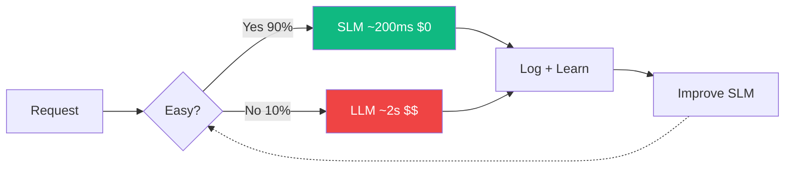

<div style="display: flex; flex-direction: column; align-items: center; justify-content: center; height: 100%; text-align: center;">
  <div style="font-size: 42px; font-weight: 800; letter-spacing: -1.5px; background: linear-gradient(135deg, #f97316, #eab308); -webkit-background-clip: text; -webkit-text-fill-color: transparent; line-height: 1.1;">Small Models, Big Impact</div>
  <div style="color: rgba(255,255,255,0.45); font-size: 16px; margin-top: 12px; letter-spacing: 0.5px;">Why Your Next Production System Doesn't Need a GPT</div>
  <div style="margin-top: 32px; padding: 5px 16px; border-radius: 99px; background: rgba(249,115,22,0.08); border: 1px solid rgba(249,115,22,0.2); color: rgba(249,115,22,0.7); font-size: 11px;">PyConf Hyderabad 2026</div>
  <div style="color: rgba(255,255,255,0.25); font-size: 11px; margin-top: 20px;">Gokulavasan Murali · Head of Engineering, Emma Robots Inc.</div>
</div>

<!--
Open with energy. This is about rethinking how we build AI systems.
-->

---
layout: center
---

<div style="font-size: 24px; font-weight: 800; letter-spacing: -0.5px; background: linear-gradient(135deg, #f97316, #eab308); -webkit-background-clip: text; -webkit-text-fill-color: transparent; text-align: center; margin-bottom: 32px;">Where Are You on the AI Spectrum?</div>

<div style="display: flex; gap: 16px;">

<div style="flex: 1; text-align: center; padding: 20px 12px; border-radius: 10px; border: 1px solid rgba(249,115,22,0.12); background: rgba(249,115,22,0.03); min-height: 140px;">
  <div v-click>
    <mdi-robot-happy style="font-size: 40px; color: #f97316; margin-bottom: 10px;" />
    <div style="font-size: 15px; font-weight: 700; color: rgba(255,255,255,0.8); line-height: 1.4;">Used ChatGPT, Claude or Gemini?</div>
  </div>
</div>

<div style="flex: 1; text-align: center; padding: 20px 12px; border-radius: 10px; border: 1px solid rgba(249,115,22,0.12); background: rgba(249,115,22,0.03); min-height: 140px;">
  <div v-click>
    <mdi-head-cog style="font-size: 40px; color: #eab308; margin-bottom: 10px;" />
    <div style="font-size: 15px; font-weight: 700; color: rgba(255,255,255,0.8); line-height: 1.4;">Tried Llama / Qwen Mistral / Gemma?</div>
  </div>
</div>

<div style="flex: 1; text-align: center; padding: 20px 12px; border-radius: 10px; border: 1px solid rgba(249,115,22,0.12); background: rgba(249,115,22,0.03); min-height: 140px;">
  <div v-click>
    <mdi-code-braces style="font-size: 40px; color: #f97316; margin-bottom: 10px;" />
    <div style="font-size: 15px; font-weight: 700; color: rgba(255,255,255,0.8); line-height: 1.4;">Used an LLM API to build something?</div>
  </div>
</div>

<div style="flex: 1; text-align: center; padding: 20px 12px; border-radius: 10px; border: 1px solid rgba(249,115,22,0.12); background: rgba(249,115,22,0.03); min-height: 140px;">
  <div v-click>
    <mdi-server style="font-size: 40px; color: #eab308; margin-bottom: 10px;" />
    <div style="font-size: 15px; font-weight: 700; color: rgba(255,255,255,0.8); line-height: 1.4;">Deployed a model to production?</div>
  </div>
</div>

</div>

<!--
Gauge the room. Expect most hands on 1, fewer as we go down. This sets up why SLMs matter — most people are stuck at cloud LLMs.
-->

---
layout: default
---

<div style="font-size: 24px; font-weight: 800; letter-spacing: -0.5px; background: linear-gradient(135deg, #f97316, #eab308); -webkit-background-clip: text; -webkit-text-fill-color: transparent;">About Me</div>

<div style="display: flex; gap: 24px; margin-top: 16px;">
  <div style="flex: 1;">
    <div style="display: grid; grid-template-columns: 1fr 1fr; gap: 8px;">
      
      
      
      
    </div>
  </div>
  <div style="flex: 1; display: flex; flex-direction: column; justify-content: center;">
    <div style="font-size: 32px; font-weight: 800; color: rgba(255,255,255,0.9); letter-spacing: -0.5px;">Gokulavasan Murali</div>
    <div style="display: flex; align-items: center; gap: 10px; margin-top: 12px;">
      <div style="width: 36px; height: 2px; background: linear-gradient(90deg, #f97316, #eab308);" />
      <div style="font-size: 15px; color: #f97316;">Head of Engineering @ Emma Robots</div>
    </div>
    <div style="margin-top: 20px; font-size: 14px; line-height: 1.8; color: rgba(255,255,255,0.5);">
      From edge devices to mobile ML to vision-first RPA — building systems where "just add GPUs" was never an option.
    </div>
  </div>
</div>

<!--
Decade long exp in building ML/AL products under constrained embedded compute where GPU was a luxury.
 Autonomous underwater vehicles, rovers
- Among the first to deploy TF Lite models on App Store and Play Store: not just object detection but 3D reconstruction models for logistics


- Autonomous underwater vehicles, rovers
- Among the first to deploy TF Lite models on App Store and Play Store: not just object detection but 3D reconstruction models for logistics
- Plena/Chief: AI Sales Agents, browser-based workflow automation and RPA
- Emma: pioneering Vision-First RPA and Computer Using Agent (CUA) systems
- PyCon India organizer
-->

---
layout: image-right
image: /ferrari-civic.png
backgroundSize: contain
---

<div style="display: flex; flex-direction: column; justify-content: center; height: 100%;">

<v-clicks>

- Your users don't care about parameter counts
- They care about **speed**, **cost**, and **reliability**
- Most AI tasks don't need 400B parameters

</v-clicks>

</div>

<!--
The Ferrari vs Civic analogy. Most production tasks are the Civic — reliable, efficient, gets the job done.
-->

---

<div style="font-size: 24px; font-weight: 800; letter-spacing: -0.5px; background: linear-gradient(135deg, #f97316, #eab308); -webkit-background-clip: text; -webkit-text-fill-color: transparent;">What You'll Get From This Talk</div>

<div style="margin-top: 24px; display: flex; flex-direction: column; gap: 12px;">

<div style="display: flex; align-items: center; gap: 14px; padding: 12px 16px; border-radius: 8px; background: linear-gradient(90deg, rgba(239,68,68,0.08), transparent); border-left: 2px solid rgba(239,68,68,0.5);">
  <mdi-alert-circle style="font-size: 24px; color: #ef4444; flex-shrink: 0;" />
  <div style="color: rgba(255,255,255,0.75); font-size: 14px;">The problem: why **"bigger" isn't always "better"** in production</div>
</div>

<div style="display: flex; align-items: center; gap: 14px; padding: 12px 16px; border-radius: 8px; background: linear-gradient(90deg, rgba(249,115,22,0.08), transparent); border-left: 2px solid rgba(249,115,22,0.5);">
  <mdi-trending-up style="font-size: 24px; color: #f97316; flex-shrink: 0;" />
  <div style="color: rgba(255,255,255,0.75); font-size: 14px;">Rise of SLMs: **what counts as small** and what changed in the ecosystem</div>
</div>

<div style="display: flex; align-items: center; gap: 14px; padding: 12px 16px; border-radius: 8px; background: linear-gradient(90deg, rgba(16,185,129,0.08), transparent); border-left: 2px solid rgba(16,185,129,0.5);">
  <mdi-arrow-decision style="font-size: 24px; color: #10b981; flex-shrink: 0;" />
  <div style="color: rgba(255,255,255,0.75); font-size: 14px;">3 paths to small: **quantization, distillation, purpose-built** models</div>
</div>

<div style="display: flex; align-items: center; gap: 14px; padding: 12px 16px; border-radius: 8px; background: linear-gradient(90deg, rgba(234,179,8,0.08), transparent); border-left: 2px solid rgba(234,179,8,0.5);">
  <mdi-play-circle style="font-size: 24px; color: #eab308; flex-shrink: 0;" />
  <div style="color: rgba(255,255,255,0.75); font-size: 14px;">**Live demos** + metrics: code gen, PDF parsing, JSON extraction, RPA vision</div>
</div>

<div style="display: flex; align-items: center; gap: 14px; padding: 12px 16px; border-radius: 8px; background: linear-gradient(90deg, rgba(139,92,246,0.08), transparent); border-left: 2px solid rgba(139,92,246,0.5);">
  <mdi-shield-check style="font-size: 24px; color: #8b5cf6; flex-shrink: 0;" />
  <div style="color: rgba(255,255,255,0.75); font-size: 14px;">When **not** to use SLMs + the future of **cascades & composability**</div>
</div>

</div>

---

<div style="display: flex; flex-direction: column; align-items: center; justify-content: center; height: 100%; text-align: center;">
  <div style="font-size: 10px; text-transform: uppercase; letter-spacing: 4px; color: rgba(249,115,22,0.5); margin-bottom: 12px;">Part 01</div>
  <div style="font-size: 32px; font-weight: 800; color: rgba(255,255,255,0.9); letter-spacing: -0.5px;">The Problem</div>
  <div style="width: 40px; height: 2px; background: linear-gradient(90deg, #f97316, #eab308); margin-top: 14px; border-radius: 1px;"></div>
  <div style="color: rgba(255,255,255,0.3); font-size: 14px; margin-top: 12px;">Why "bigger" isn't always "better"</div>
</div>

---

<div style="font-size: 24px; font-weight: 800; letter-spacing: -0.5px; background: linear-gradient(135deg, #f97316, #eab308); -webkit-background-clip: text; -webkit-text-fill-color: transparent;">Today's Architecture</div>

<div style="display: flex; flex-direction: column; align-items: center; gap: 0; margin-top: 24px; position: relative;">

<div style="padding: 10px 28px; border-radius: 6px; background: rgba(249,115,22,0.06); border: 1px solid rgba(249,115,22,0.2); color: rgba(249,115,22,0.8); font-weight: 700; font-size: 13px; letter-spacing: 0.5px;">APPLICATION</div>

<div style="width: 2px; height: 20px; background: linear-gradient(to bottom, rgba(249,115,22,0.3), rgba(239,68,68,0.3));"></div>

<div style="border: 1px dashed rgba(249,115,22,0.15); border-radius: 10px; padding: 18px 28px; position: relative; background: rgba(249,115,22,0.02);">
<div style="position: absolute; top: -9px; left: 50%; transform: translateX(-50%); background: #1a1a2e; padding: 0 12px; font-size: 8px; text-transform: uppercase; letter-spacing: 3px; color: rgba(249,115,22,0.35);">loop until done</div>

<div style="display: flex; align-items: center; gap: 14px;">

<div style="padding: 12px 18px; border-radius: 8px; background: rgba(249,115,22,0.06); border: 1px solid rgba(249,115,22,0.2); text-align: center; min-width: 100px;">
<div style="color: #f97316; font-weight: 700; font-size: 13px;">Prompt</div>
<div style="color: rgba(249,115,22,0.4); font-size: 8px; margin-top: 3px;">tasks · screenshots · context</div>
</div>

<div style="display: flex; align-items: center; gap: 4px;">
<div style="width: 24px; height: 1px; background: rgba(249,115,22,0.2);"></div>
<div style="color: rgba(249,115,22,0.3); font-size: 12px;">▸</div>
</div>

<div style="padding: 14px 24px; border-radius: 8px; background: linear-gradient(135deg, rgba(239,68,68,0.1), rgba(249,115,22,0.05)); border: 1px solid rgba(239,68,68,0.25); text-align: center; box-shadow: 0 0 24px rgba(239,68,68,0.08); min-width: 140px;">
<div style="background: linear-gradient(135deg, #ef4444, #f97316); -webkit-background-clip: text; -webkit-text-fill-color: transparent; font-weight: 800; font-size: 16px; letter-spacing: 0.5px;">LLM</div>
<div style="color: rgba(239,68,68,0.35); font-size: 8px; margin-top: 3px;">GPT-4 · Claude · Gemini</div>
</div>

<div style="display: flex; align-items: center; gap: 4px;">
<div style="width: 24px; height: 1px; background: rgba(16,185,129,0.2);"></div>
<div style="color: rgba(16,185,129,0.3); font-size: 12px;">▸</div>
</div>

<div style="padding: 12px 18px; border-radius: 8px; background: rgba(16,185,129,0.06); border: 1px solid rgba(16,185,129,0.2); text-align: center; min-width: 80px;">
<div style="color: #10b981; font-weight: 700; font-size: 13px;">Result</div>
</div>

</div>

<div style="position: absolute; bottom: 6px; right: 14px; font-size: 7px; color: rgba(249,115,22,0.2);">↻ repeat every step</div>
</div>

<div style="width: 2px; height: 20px; background: linear-gradient(to bottom, rgba(16,185,129,0.3), rgba(249,115,22,0.3));"></div>

<div style="padding: 10px 28px; border-radius: 6px; background: rgba(249,115,22,0.06); border: 1px solid rgba(249,115,22,0.2); color: rgba(249,115,22,0.8); font-weight: 700; font-size: 13px; letter-spacing: 0.5px;">APPLICATION</div>

<div style="margin-top: 20px; display: flex; gap: 20px; justify-content: center;">
<div style="display: flex; align-items: center; gap: 6px;"><div style="width: 6px; height: 6px; border-radius: 50%; background: #ef4444;"></div><span style="font-size: 10px; color: rgba(255,255,255,0.3);">Single point of failure</span></div>
<div style="display: flex; align-items: center; gap: 6px;"><div style="width: 6px; height: 6px; border-radius: 50%; background: #f97316;"></div><span style="font-size: 10px; color: rgba(255,255,255,0.3);">Context bloat per loop</span></div>
<div style="display: flex; align-items: center; gap: 6px;"><div style="width: 6px; height: 6px; border-radius: 50%; background: #eab308;"></div><span style="font-size: 10px; color: rgba(255,255,255,0.3);">Escalating cost</span></div>
</div>

</div>

<!--
Current architecture: single LLM in a loop. Every step sends full context to one massive model.
Cost compounds, latency stacks, single point of failure. This is how most production systems work today.
-->

---

<div style="display: grid; grid-template-columns: 1fr 1fr; gap: 10px;">

<v-click>
<div style="padding: 14px 16px; border-radius: 8px; background: linear-gradient(135deg, rgba(249,115,22,0.08), rgba(234,179,8,0.03)); border: 1px solid rgba(249,115,22,0.15); display: flex; flex-direction: column; justify-content: space-between;">
  <div>
    <div style="background: linear-gradient(135deg, #f97316, #eab308); -webkit-background-clip: text; -webkit-text-fill-color: transparent; font-size: 30px; font-weight: 900; line-height: 1; letter-spacing: -1px;">1s+</div>
    <div style="color: rgba(255,255,255,0.75); font-size: 12px; font-weight: 700; margin-top: 4px;">Latency budgets are brutal</div>
    <div style="color: rgba(255,255,255,0.35); font-size: 9px; line-height: 1.4; margin-top: 4px;">5 sequential tool calls × ~200ms TTFT each — and that's at low load. Under traffic, your p99 looks nothing like your p50.</div>
  </div>
  <div>
    <span style="font-size: 8px; padding: 2px 8px; border-radius: 99px; background: rgba(249,115,22,0.1); color: rgba(249,115,22,0.7); display: inline-block; margin-top: 6px;">Sub-second is now baseline UX expectation</span>
    <div style="font-size: 7px; color: rgba(255,255,255,0.25); margin-top: 3px;">NVIDIA NIM benchmarks + field observation</div>
  </div>
</div>
</v-click>

<v-click>
<div style="padding: 14px 16px; border-radius: 8px; background: linear-gradient(135deg, rgba(139,92,246,0.08), rgba(249,115,22,0.03)); border: 1px solid rgba(139,92,246,0.15); display: flex; flex-direction: column; justify-content: space-between;">
  <div>
    <div style="background: linear-gradient(135deg, #8b5cf6, #f97316); -webkit-background-clip: text; -webkit-text-fill-color: transparent; font-size: 30px; font-weight: 900; line-height: 1; letter-spacing: -1px;">15×</div>
    <div style="color: rgba(255,255,255,0.75); font-size: 12px; font-weight: 700; margin-top: 4px;">Cost compounds fast</div>
    <div style="color: rgba(255,255,255,0.35); font-size: 9px; line-height: 1.4; margin-top: 4px;">Context accumulates across agent steps — by step 5, you're passing 10K tokens even if each reply is short. Retries triple the bill silently.</div>
  </div>
  <div>
    <span style="font-size: 8px; padding: 2px 8px; border-radius: 99px; background: rgba(139,92,246,0.1); color: rgba(139,92,246,0.7); display: inline-block; margin-top: 6px;">$0.025/req × 100K/day = $75K/month</span>
    <div style="font-size: 7px; color: rgba(255,255,255,0.25); margin-top: 3px;">CodeAnt AI, LLM Cost Calculation Guide 2025</div>
  </div>
</div>
</v-click>

<v-click>
<div style="padding: 14px 16px; border-radius: 8px; background: linear-gradient(135deg, rgba(239,68,68,0.08), rgba(249,115,22,0.03)); border: 1px solid rgba(239,68,68,0.15); display: flex; flex-direction: column; justify-content: space-between;">
  <div>
    <div style="background: linear-gradient(135deg, #ef4444, #f97316); -webkit-background-clip: text; -webkit-text-fill-color: transparent; font-size: 30px; font-weight: 900; line-height: 1; letter-spacing: -1px;">77%</div>
    <div style="color: rgba(255,255,255,0.75); font-size: 12px; font-weight: 700; margin-top: 4px;">Data is already leaving your firewall</div>
    <div style="color: rgba(255,255,255,0.35); font-size: 9px; line-height: 1.4; margin-top: 4px;">Source code, client data, internal docs — pasted into personal ChatGPT accounts with zero enterprise visibility. Samsung found out the hard way.</div>
  </div>
  <div>
    <span style="font-size: 8px; padding: 2px 8px; border-radius: 99px; background: rgba(239,68,68,0.1); color: rgba(239,68,68,0.7); display: inline-block; margin-top: 6px;">82% from unmanaged personal accounts</span>
    <div style="font-size: 7px; color: rgba(255,255,255,0.25); margin-top: 3px;">LayerX Enterprise AI & SaaS Security Report 2025</div>
  </div>
</div>
</v-click>

<v-click>
<div style="padding: 14px 16px; border-radius: 8px; background: linear-gradient(135deg, rgba(16,185,129,0.08), rgba(234,179,8,0.03)); border: 1px solid rgba(16,185,129,0.15); display: flex; flex-direction: column; justify-content: space-between;">
  <div>
    <div style="background: linear-gradient(135deg, #10b981, #eab308); -webkit-background-clip: text; -webkit-text-fill-color: transparent; font-size: 30px; font-weight: 900; line-height: 1; letter-spacing: -1px;">~12%</div>
    <div style="color: rgba(255,255,255,0.75); font-size: 12px; font-weight: 700; margin-top: 4px;">JSON breaks in production</div>
    <div style="color: rgba(255,255,255,0.35); font-size: 9px; line-height: 1.4; margin-top: 4px;">Model updates silently change output shape. One malformed response cascades the whole agent chain. Prompt-only enforcement isn't enough.</div>
  </div>
  <div>
    <span style="font-size: 8px; padding: 2px 8px; border-radius: 99px; background: rgba(16,185,129,0.1); color: rgba(16,185,129,0.7); display: inline-block; margin-top: 6px;">Constrained decoding: 95–99% conformance</span>
    <div style="font-size: 7px; color: rgba(255,255,255,0.25); margin-top: 3px;">Han et al., NeurIPS 2023 / JSONSchemaBench 2025</div>
  </div>
</div>
</v-click>

</div>

<!--
Latency: 5 sequential tool calls × ~200ms TTFT each — self-evident math every agent developer has felt.
Cost: $0.025/req × 100K/day = $2,500/day — from published breakdowns. Context accumulates across agent steps.
Privacy: LayerX Enterprise AI Security Report 2025 — 77% paste company data, 82% from personal unmanaged accounts. Samsung source code leak is the canonical example.
Reliability: Han et al. 2023 / JSONSchemaBench 2025 — ~12% invalid JSON for complex schemas (GPT-4, NeurIPS). Basic: 70-90% conformance, with constrained decoding: 95-99%.
The opportunity: Handle 90% of tasks locally and cheaply — escalate only the hard 10%.
-->

---

# LLMs Are Stateless by Design

<div class="grid grid-cols-2 gap-8 mt-2">
<div class="flex flex-col gap-4">

<div class="p-4 rounded-xl" style="background: rgba(99,102,241,0.07); border: 1px solid rgba(99,102,241,0.25);">
  <p class="font-medium text-sm mb-1">Every API call is a cold start</p>
  <p class="text-xs text-gray-400 leading-relaxed">No memory of last session, last user, last outcome. The model that just helped your user onboard won't remember them in 10 minutes. Memory is your problem, not the model's.</p>
</div>

<div class="p-4 rounded-xl" style="background: rgba(99,102,241,0.07); border: 1px solid rgba(99,102,241,0.25);">
  <p class="font-medium text-sm mb-1">Workarounds are expensive by design</p>
  <p class="text-xs text-gray-400 leading-relaxed">Mem0, MemGPT, LangChain memory — all re-inject state into the context window on every call. By turn 10, you're paying for 10K+ tokens of history even if the reply is two sentences. Context cost scales quadratically with length.</p>
  <div class="flex gap-2 mt-2 flex-wrap">
    <span class="text-xs px-2 py-0.5 rounded-full" style="background: rgba(99,102,241,0.12); color: #a5b4fc;">Mem0</span>
    <span class="text-xs px-2 py-0.5 rounded-full" style="background: rgba(99,102,241,0.12); color: #a5b4fc;">MemGPT</span>
    <span class="text-xs px-2 py-0.5 rounded-full" style="background: rgba(99,102,241,0.12); color: #a5b4fc;">LangChain Memory</span>
  </div>
</div>

<div class="p-4 rounded-xl" style="background: rgba(99,102,241,0.07); border: 1px solid rgba(99,102,241,0.25);">
  <p class="font-medium text-sm mb-1">Long context ≠ good memory</p>
  <p class="text-xs text-gray-400 leading-relaxed">Models demonstrably miss information buried in the middle of long contexts — even when it's technically present. Flawed memories get replayed and compounded, degrading agent performance over time.</p>
  <span class="text-xs px-2 py-0.5 rounded-full mt-2 inline-block" style="background: rgba(99,102,241,0.12); color: #a5b4fc;">"Lost in the middle" — Liu et al., 2024</span>
</div>

</div>

<div class="flex flex-col gap-4 mt-1">

<div class="p-4 rounded-xl" style="background: rgba(15,110,86,0.07); border: 1px solid rgba(15,110,86,0.25);">
  <p class="text-xs font-semibold uppercase tracking-widest mb-3" style="color: #6ee7b7;">With SLM</p>
  <div class="flex flex-col gap-2">
    <div class="flex items-start gap-2">
      <span style="color: #6ee7b7;" class="text-xs mt-0.5">✓</span>
      <p class="text-xs text-gray-300 leading-relaxed">You own the process — control the KV cache, session state, and memory store directly</p>
    </div>
    <div class="flex items-start gap-2">
      <span style="color: #6ee7b7;" class="text-xs mt-0.5">✓</span>
      <p class="text-xs text-gray-300 leading-relaxed">State is a first-class citizen — not an API bolt-on charged per token</p>
    </div>
    <div class="flex items-start gap-2">
      <span style="color: #6ee7b7;" class="text-xs mt-0.5">✓</span>
      <p class="text-xs text-gray-300 leading-relaxed">Persist state across sessions with zero per-token billing — flat infra cost</p>
    </div>
  </div>
</div>

<div class="p-5 rounded-xl" style="background: rgba(220,60,60,0.07); border: 1px solid rgba(220,60,60,0.25);">
  <span class="text-xs font-semibold uppercase tracking-widest" style="color: #f87171;">The real cost</span>
  <p class="mt-2 text-sm leading-relaxed text-gray-300">Re-submitting a 100K-token history on every turn accumulates fast. Prompt caching gives a 90% discount on cached prefix — but each new turn still pays for the uncached delta. <strong class="text-white">For long-running agents, frontier LLMs lose the cost battle as session depth grows.</strong></p>
  <p class="text-[10px] mt-2 text-gray-500">arxiv:2603.04814, March 2026</p>
</div>

</div>
</div>

---

# You Can't Observe What You Can't Run

<div class="grid grid-cols-2 gap-8 mt-2">
<div class="flex flex-col gap-4">

<div class="p-4 rounded-xl" style="background: rgba(249,115,22,0.07); border: 1px solid rgba(249,115,22,0.25);">
  <div class="flex justify-between items-start">
    <div>
      <p class="font-medium text-sm mb-1">A frontier LLM is a black box with a price tag</p>
      <p class="text-xs text-gray-400 leading-relaxed">Tokens in, tokens out. No access to attention weights, activations, confidence scores, or intermediate representations. Debugging a failure means prompt archaeology.</p>
    </div>
    <div class="text-right ml-4 shrink-0">
      <div class="text-2xl font-medium" style="color: #f97316;">0</div>
      <div class="text-[10px] text-gray-500 leading-tight">layers you<br>can inspect</div>
    </div>
  </div>
</div>

<div class="p-4 rounded-xl" style="background: rgba(249,115,22,0.07); border: 1px solid rgba(249,115,22,0.25);">
  <p class="font-medium text-sm mb-1">No architecture-level control</p>
  <p class="text-xs text-gray-400 leading-relaxed">You can't add task-specific output heads, apply constrained decoding at the model level, customise tokenisation, or attach confidence thresholds. You're working with what the provider shipped.</p>
  <div class="flex gap-2 mt-2 flex-wrap">
    <span class="text-xs px-2 py-0.5 rounded-full" style="background: rgba(249,115,22,0.12); color: #fdba74;">No output heads</span>
    <span class="text-xs px-2 py-0.5 rounded-full" style="background: rgba(249,115,22,0.12); color: #fdba74;">No constrained decoding</span>
    <span class="text-xs px-2 py-0.5 rounded-full" style="background: rgba(249,115,22,0.12); color: #fdba74;">No confidence scores</span>
  </div>
</div>

<div class="p-4 rounded-xl" style="background: rgba(249,115,22,0.07); border: 1px solid rgba(249,115,22,0.25);">
  <p class="font-medium text-sm mb-1">"The model said so" is not an audit trail</p>
  <p class="text-xs text-gray-400 leading-relaxed">Healthcare, finance, and legal require explainability. Regulators don't accept opaque AI outputs. EU AI Act 2025 classifies many domain AI applications as high-risk — mandating transparency, traceability, and human oversight.</p>
  <span class="text-xs px-2 py-0.5 rounded-full mt-2 inline-block" style="background: rgba(249,115,22,0.12); color: #fdba74;">EU AI Act · 7% global revenue fine for non-compliance</span>
</div>

</div>

<div class="flex flex-col gap-4 mt-1">

<div class="p-4 rounded-xl" style="background: rgba(15,110,86,0.07); border: 1px solid rgba(15,110,86,0.25);">
  <p class="text-xs font-semibold uppercase tracking-widest mb-3" style="color: #6ee7b7;">With SLM — open weights = full observability</p>
  <div class="flex flex-col gap-2">
    <div class="flex items-start gap-2">
      <span style="color: #6ee7b7;" class="text-xs mt-0.5">✓</span>
      <p class="text-xs text-gray-300 leading-relaxed">Inspect activations and attention — understand <em>why</em> the model produced an output</p>
    </div>
    <div class="flex items-start gap-2">
      <span style="color: #6ee7b7;" class="text-xs mt-0.5">✓</span>
      <p class="text-xs text-gray-300 leading-relaxed">Constrained decoding with XGrammar / Outlines / vLLM — 95–99% schema conformance</p>
    </div>
    <div class="flex items-start gap-2">
      <span style="color: #6ee7b7;" class="text-xs mt-0.5">✓</span>
      <p class="text-xs text-gray-300 leading-relaxed">Add task-specific output heads, confidence thresholds, and custom tokenisation</p>
    </div>
    <div class="flex items-start gap-2">
      <span style="color: #6ee7b7;" class="text-xs mt-0.5">✓</span>
      <p class="text-xs text-gray-300 leading-relaxed">Deterministic evals at the layer level — write tests the way you write unit tests</p>
    </div>
  </div>
</div>

<div class="p-4 rounded-xl text-center" style="background: rgba(249,115,22,0.05); border: 1px solid rgba(249,115,22,0.2);">
  <p class="text-sm text-gray-300 leading-relaxed">You wouldn't ship a microservice you can't profile.<br><strong class="text-white">Why are you shipping AI you can't inspect?</strong></p>
</div>

</div>
</div>

---

<div style="display: flex; flex-direction: column; align-items: center; justify-content: center; height: 100%; text-align: center;">
  <div style="font-size: 10px; text-transform: uppercase; letter-spacing: 4px; color: rgba(249,115,22,0.5); margin-bottom: 12px;">Part 02</div>
  <div style="font-size: 32px; font-weight: 800; color: rgba(255,255,255,0.9); letter-spacing: -0.5px;">Rise of Small Language Models</div>
  <div style="width: 40px; height: 2px; background: linear-gradient(90deg, #f97316, #eab308); margin-top: 14px; border-radius: 1px;"></div>
  <div style="color: rgba(255,255,255,0.3); font-size: 14px; margin-top: 12px;">What changed in the ecosystem</div>
</div>

---
zoom: 0.55
---

<div style="width:1640px; margin:0 auto;">
<div style="display:flex; justify-content:space-between; align-items:flex-end; margin-bottom:18px; flex-wrap:wrap; gap:10px;">
  <div>
    <div style="color:rgba(255,255,255,0.85); font-size:16px; font-weight:500; letter-spacing:-0.01em;">The rise of small language models</div>
    <div style="color:rgba(255,255,255,0.35); font-size:11px; margin-top:3px;">Sep 2023 – Mar 2026 · 17 key releases · 8 labs</div>
  </div>
  <div style="display:flex; gap:18px; flex-wrap:wrap; align-items:center;">
    <div style="display:flex; align-items:center; gap:5px; font-size:11px; color:rgba(255,255,255,0.45);"><span style="width:8px; height:8px; border-radius:50%; background:#C8861A; display:inline-block;"></span>Mistral AI</div>
    <div style="display:flex; align-items:center; gap:5px; font-size:11px; color:rgba(255,255,255,0.45);"><span style="width:8px; height:8px; border-radius:50%; background:#3B8FD4; display:inline-block;"></span>Microsoft</div>
    <div style="display:flex; align-items:center; gap:5px; font-size:11px; color:rgba(255,255,255,0.45);"><span style="width:8px; height:8px; border-radius:50%; background:#1DAA7A; display:inline-block;"></span>Google</div>
    <div style="display:flex; align-items:center; gap:5px; font-size:11px; color:rgba(255,255,255,0.45);"><span style="width:8px; height:8px; border-radius:50%; background:#E05E2A; display:inline-block;"></span>Alibaba</div>
    <div style="display:flex; align-items:center; gap:5px; font-size:11px; color:rgba(255,255,255,0.45);"><span style="width:8px; height:8px; border-radius:50%; background:#8A7FE0; display:inline-block;"></span>HuggingFace</div>
    <div style="display:flex; align-items:center; gap:5px; font-size:11px; color:rgba(255,255,255,0.45);"><span style="width:8px; height:8px; border-radius:50%; background:#5FAA22; display:inline-block;"></span>Meta</div>
    <div style="display:flex; align-items:center; gap:5px; font-size:11px; color:rgba(255,255,255,0.45);"><span style="width:8px; height:8px; border-radius:50%; background:#D45892; display:inline-block;"></span>DeepSeek</div>
    <div style="display:flex; align-items:center; gap:5px; font-size:11px; color:rgba(255,255,255,0.45);"><span style="width:8px; height:8px; border-radius:50%; background:#8A8A85; display:inline-block;"></span>OpenAI</div>
  </div>
</div>

<div style="position:relative; width:1640px; height:420px;">

<!-- Era bands -->
<div style="position:absolute; left:90px; top:85px; width:195px; height:240px; background:rgba(255,255,255,0.02); border:1px solid rgba(255,255,255,0.04);">
  <div style="padding:4px 6px; font-size:10px; font-weight:500; color:rgba(255,255,255,0.22);">The thesis</div>
  <div style="padding:0 6px; font-size:9px; color:rgba(255,255,255,0.12);">proven</div>
</div>
<div style="position:absolute; left:285px; top:85px; width:584px; height:240px; background:rgba(255,255,255,0.02); border:1px solid rgba(255,255,255,0.04);">
  <div style="padding:4px 6px; font-size:10px; font-weight:500; color:rgba(255,255,255,0.22);">The explosion</div>
  <div style="padding:0 6px; font-size:9px; color:rgba(255,255,255,0.12);">6 families in 12 months</div>
</div>
<div style="position:absolute; left:869px; top:85px; width:584px; height:240px; background:rgba(255,255,255,0.02); border:1px solid rgba(255,255,255,0.04);">
  <div style="padding:4px 6px; font-size:10px; font-weight:500; color:rgba(255,255,255,0.22);">On-device becomes mainstream</div>
</div>
<div style="position:absolute; left:1453px; top:85px; width:97px; height:240px; background:rgba(255,255,255,0.02); border:1px solid rgba(255,255,255,0.04);">
  <div style="padding:4px 6px; font-size:10px; font-weight:500; color:rgba(255,255,255,0.22);">Everywhere</div>
  <div style="padding:0 6px; font-size:9px; color:rgba(255,255,255,0.12);">2026</div>
</div>

<!-- Year dividers -->
<div style="position:absolute; left:90px; top:35px; width:1px; height:345px; background:repeating-linear-gradient(to bottom, rgba(255,255,255,0.1) 0px, rgba(255,255,255,0.1) 3px, transparent 3px, transparent 7px);"></div>
<div style="position:absolute; left:94px; top:202px; font-size:10px; color:rgba(255,255,255,0.2); font-family:system-ui,sans-serif;">Sep 2023</div>
<div style="position:absolute; left:285px; top:35px; width:1px; height:345px; background:repeating-linear-gradient(to bottom, rgba(255,255,255,0.1) 0px, rgba(255,255,255,0.1) 3px, transparent 3px, transparent 7px);"></div>
<div style="position:absolute; left:289px; top:202px; font-size:10px; color:rgba(255,255,255,0.2); font-family:system-ui,sans-serif;">Jan 2024</div>
<div style="position:absolute; left:869px; top:35px; width:1px; height:345px; background:repeating-linear-gradient(to bottom, rgba(255,255,255,0.1) 0px, rgba(255,255,255,0.1) 3px, transparent 3px, transparent 7px);"></div>
<div style="position:absolute; left:873px; top:202px; font-size:10px; color:rgba(255,255,255,0.2); font-family:system-ui,sans-serif;">Jan 2025</div>
<div style="position:absolute; left:1453px; top:35px; width:1px; height:345px; background:repeating-linear-gradient(to bottom, rgba(255,255,255,0.1) 0px, rgba(255,255,255,0.1) 3px, transparent 3px, transparent 7px);"></div>
<div style="position:absolute; left:1457px; top:202px; font-size:10px; color:rgba(255,255,255,0.2); font-family:system-ui,sans-serif;">Jan 2026</div>

<!-- Timeline line -->
<div style="position:absolute; left:90px; top:204px; width:1460px; height:2px; background:rgba(255,255,255,0.18);"></div>

<!-- 1. Mistral 7B — above0 x=90 -->
<div style="position:absolute; left:24px; top:105px; width:132px; height:73px; border-radius:6px; background:rgba(200,134,26,0.08); border:1px solid rgba(200,134,26,0.7); text-align:center;">
  <div style="font-size:11px; font-weight:600; color:rgba(255,255,255,0.88); margin-top:8px;">Mistral 7B</div>
  <div style="font-size:10px; font-weight:500; color:#C8861A; margin-top:2px;">Mistral AI</div>
  <div style="width:116px; height:1px; background:rgba(200,134,26,0.3); margin:5px auto 4px;"></div>
  <div style="font-size:9.5px; color:rgba(255,255,255,0.38);">First 7B to rival</div>
  <div style="font-size:9.5px; color:rgba(255,255,255,0.38);">5× larger models</div>
</div>
<div style="position:absolute; left:90px; top:178px; width:1px; height:27px; background:#C8861A; opacity:0.55;"></div>
<div style="position:absolute; left:82px; top:197px; width:16px; height:16px; border-radius:50%; background:rgba(200,134,26,0.15);"></div>
<div style="position:absolute; left:85px; top:200px; width:10px; height:10px; border-radius:50%; background:#C8861A; border:2px solid #0c0a09;"></div>

<!-- 2. Phi-1.5 1.3B — below0 x=187 -->
<div style="position:absolute; left:179px; top:197px; width:16px; height:16px; border-radius:50%; background:rgba(59,143,212,0.15);"></div>
<div style="position:absolute; left:182px; top:200px; width:10px; height:10px; border-radius:50%; background:#3B8FD4; border:2px solid #0c0a09;"></div>
<div style="position:absolute; left:187px; top:205px; width:1px; height:27px; background:#3B8FD4; opacity:0.55;"></div>
<div style="position:absolute; left:121px; top:232px; width:132px; height:73px; border-radius:6px; background:rgba(59,143,212,0.08); border:1px solid rgba(59,143,212,0.7); text-align:center;">
  <div style="font-size:11px; font-weight:600; color:rgba(255,255,255,0.88); margin-top:8px;">Phi-1.5  1.3B</div>
  <div style="font-size:10px; font-weight:500; color:#3B8FD4; margin-top:2px;">Microsoft</div>
  <div style="width:116px; height:1px; background:rgba(59,143,212,0.3); margin:5px auto 4px;"></div>
  <div style="font-size:9.5px; color:rgba(255,255,255,0.38);">Synthetic data</div>
  <div style="font-size:9.5px; color:rgba(255,255,255,0.38);">beats raw scale</div>
</div>

<!-- 3. Gemma 2B/7B — above0 x=333 -->
<div style="position:absolute; left:267px; top:105px; width:132px; height:73px; border-radius:6px; background:rgba(29,170,122,0.08); border:1px solid rgba(29,170,122,0.7); text-align:center;">
  <div style="font-size:11px; font-weight:600; color:rgba(255,255,255,0.88); margin-top:8px;">Gemma 2B / 7B</div>
  <div style="font-size:10px; font-weight:500; color:#1DAA7A; margin-top:2px;">Google</div>
  <div style="width:116px; height:1px; background:rgba(29,170,122,0.3); margin:5px auto 4px;"></div>
  <div style="font-size:9.5px; color:rgba(255,255,255,0.38);">Google enters open</div>
  <div style="font-size:9.5px; color:rgba(255,255,255,0.38);">SLM space</div>
</div>
<div style="position:absolute; left:333px; top:178px; width:1px; height:27px; background:#1DAA7A; opacity:0.55;"></div>
<div style="position:absolute; left:325px; top:197px; width:16px; height:16px; border-radius:50%; background:rgba(29,170,122,0.15);"></div>
<div style="position:absolute; left:328px; top:200px; width:10px; height:10px; border-radius:50%; background:#1DAA7A; border:2px solid #0c0a09;"></div>

<!-- 4. Phi-3 Mini 3.8B — below0 x=431 -->
<div style="position:absolute; left:423px; top:197px; width:16px; height:16px; border-radius:50%; background:rgba(59,143,212,0.15);"></div>
<div style="position:absolute; left:426px; top:200px; width:10px; height:10px; border-radius:50%; background:#3B8FD4; border:2px solid #0c0a09;"></div>
<div style="position:absolute; left:431px; top:205px; width:1px; height:27px; background:#3B8FD4; opacity:0.55;"></div>
<div style="position:absolute; left:365px; top:232px; width:132px; height:73px; border-radius:6px; background:rgba(59,143,212,0.08); border:1px solid rgba(59,143,212,0.7); text-align:center;">
  <div style="font-size:11px; font-weight:600; color:rgba(255,255,255,0.88); margin-top:8px;">Phi-3 Mini  3.8B</div>
  <div style="font-size:10px; font-weight:500; color:#3B8FD4; margin-top:2px;">Microsoft</div>
  <div style="width:116px; height:1px; background:rgba(59,143,212,0.3); margin:5px auto 4px;"></div>
  <div style="font-size:9.5px; color:rgba(255,255,255,0.38);">Runs in 4 GB RAM,</div>
  <div style="font-size:9.5px; color:rgba(255,255,255,0.38);">CPU-only</div>
</div>

<!-- 5. Qwen 2 — above0 x=528 -->
<div style="position:absolute; left:462px; top:105px; width:132px; height:73px; border-radius:6px; background:rgba(224,94,42,0.08); border:1px solid rgba(224,94,42,0.7); text-align:center;">
  <div style="font-size:11px; font-weight:600; color:rgba(255,255,255,0.88); margin-top:8px;">Qwen 2</div>
  <div style="font-size:10px; font-weight:500; color:#E05E2A; margin-top:2px;">Alibaba</div>
  <div style="width:116px; height:1px; background:rgba(224,94,42,0.3); margin:5px auto 4px;"></div>
  <div style="font-size:9.5px; color:rgba(255,255,255,0.38);">0.5B–7B family,</div>
  <div style="font-size:9.5px; color:rgba(255,255,255,0.38);">embedded-ready</div>
</div>
<div style="position:absolute; left:528px; top:178px; width:1px; height:27px; background:#E05E2A; opacity:0.55;"></div>
<div style="position:absolute; left:520px; top:197px; width:16px; height:16px; border-radius:50%; background:rgba(224,94,42,0.15);"></div>
<div style="position:absolute; left:523px; top:200px; width:10px; height:10px; border-radius:50%; background:#E05E2A; border:2px solid #0c0a09;"></div>

<!-- 6. SmolLM 135M–1.7B — below0 x=625 -->
<div style="position:absolute; left:617px; top:197px; width:16px; height:16px; border-radius:50%; background:rgba(138,127,224,0.15);"></div>
<div style="position:absolute; left:620px; top:200px; width:10px; height:10px; border-radius:50%; background:#8A7FE0; border:2px solid #0c0a09;"></div>
<div style="position:absolute; left:625px; top:205px; width:1px; height:27px; background:#8A7FE0; opacity:0.55;"></div>
<div style="position:absolute; left:559px; top:232px; width:132px; height:73px; border-radius:6px; background:rgba(138,127,224,0.08); border:1px solid rgba(138,127,224,0.7); text-align:center;">
  <div style="font-size:11px; font-weight:600; color:rgba(255,255,255,0.88); margin-top:8px;">SmolLM 135M–1.7B</div>
  <div style="font-size:10px; font-weight:500; color:#8A7FE0; margin-top:2px;">HuggingFace</div>
  <div style="width:116px; height:1px; background:rgba(138,127,224,0.3); margin:5px auto 4px;"></div>
  <div style="font-size:9.5px; color:rgba(255,255,255,0.38);">In-browser inference</div>
  <div style="font-size:9.5px; color:rgba(255,255,255,0.38);">via WASM</div>
</div>

<!-- 7. Llama 3.2 1–3B — above0 x=674 -->
<div style="position:absolute; left:608px; top:105px; width:132px; height:73px; border-radius:6px; background:rgba(95,170,34,0.08); border:1px solid rgba(95,170,34,0.7); text-align:center;">
  <div style="font-size:11px; font-weight:600; color:rgba(255,255,255,0.88); margin-top:8px;">Llama 3.2  1–3B</div>
  <div style="font-size:10px; font-weight:500; color:#5FAA22; margin-top:2px;">Meta</div>
  <div style="width:116px; height:1px; background:rgba(95,170,34,0.3); margin:5px auto 4px;"></div>
  <div style="font-size:9.5px; color:rgba(255,255,255,0.38);">Meta enters the</div>
  <div style="font-size:9.5px; color:rgba(255,255,255,0.38);">sub-4B category</div>
</div>
<div style="position:absolute; left:674px; top:178px; width:1px; height:27px; background:#5FAA22; opacity:0.55;"></div>
<div style="position:absolute; left:666px; top:197px; width:16px; height:16px; border-radius:50%; background:rgba(95,170,34,0.15);"></div>
<div style="position:absolute; left:669px; top:200px; width:10px; height:10px; border-radius:50%; background:#5FAA22; border:2px solid #0c0a09;"></div>

<!-- 8. Phi-4 14B — below0 x=820 -->
<div style="position:absolute; left:812px; top:197px; width:16px; height:16px; border-radius:50%; background:rgba(59,143,212,0.15);"></div>
<div style="position:absolute; left:815px; top:200px; width:10px; height:10px; border-radius:50%; background:#3B8FD4; border:2px solid #0c0a09;"></div>
<div style="position:absolute; left:820px; top:205px; width:1px; height:27px; background:#3B8FD4; opacity:0.55;"></div>
<div style="position:absolute; left:754px; top:232px; width:132px; height:73px; border-radius:6px; background:rgba(59,143,212,0.08); border:1px solid rgba(59,143,212,0.7); text-align:center;">
  <div style="font-size:11px; font-weight:600; color:rgba(255,255,255,0.88); margin-top:8px;">Phi-4  14B</div>
  <div style="font-size:10px; font-weight:500; color:#3B8FD4; margin-top:2px;">Microsoft</div>
  <div style="width:116px; height:1px; background:rgba(59,143,212,0.3); margin:5px auto 4px;"></div>
  <div style="font-size:9.5px; color:rgba(255,255,255,0.38);">Outperforms GPT-4</div>
  <div style="font-size:9.5px; color:rgba(255,255,255,0.38);">on MATH benchmark</div>
</div>

<!-- 9. Mistral Small 3 — above0 x=869 -->
<div style="position:absolute; left:803px; top:105px; width:132px; height:73px; border-radius:6px; background:rgba(200,134,26,0.08); border:1px solid rgba(200,134,26,0.7); text-align:center;">
  <div style="font-size:11px; font-weight:600; color:rgba(255,255,255,0.88); margin-top:8px;">Mistral Small 3</div>
  <div style="font-size:10px; font-weight:500; color:#C8861A; margin-top:2px;">Mistral AI</div>
  <div style="width:116px; height:1px; background:rgba(200,134,26,0.3); margin:5px auto 4px;"></div>
  <div style="font-size:9.5px; color:rgba(255,255,255,0.38);">24B, Apache 2.0,</div>
  <div style="font-size:9.5px; color:rgba(255,255,255,0.38);">strong instruct</div>
</div>
<div style="position:absolute; left:869px; top:178px; width:1px; height:27px; background:#C8861A; opacity:0.55;"></div>
<div style="position:absolute; left:861px; top:197px; width:16px; height:16px; border-radius:50%; background:rgba(200,134,26,0.15);"></div>
<div style="position:absolute; left:864px; top:200px; width:10px; height:10px; border-radius:50%; background:#C8861A; border:2px solid #0c0a09;"></div>

<!-- 10. DeepSeek R1 1.5B — below1 x=917 -->
<div style="position:absolute; left:909px; top:197px; width:16px; height:16px; border-radius:50%; background:rgba(212,88,146,0.15);"></div>
<div style="position:absolute; left:912px; top:200px; width:10px; height:10px; border-radius:50%; background:#D45892; border:2px solid #0c0a09;"></div>
<div style="position:absolute; left:917px; top:205px; width:1px; height:115px; background:#D45892; opacity:0.55;"></div>
<div style="position:absolute; left:851px; top:320px; width:132px; height:73px; border-radius:6px; background:rgba(212,88,146,0.08); border:1px solid rgba(212,88,146,0.7); text-align:center;">
  <div style="font-size:11px; font-weight:600; color:rgba(255,255,255,0.88); margin-top:8px;">DeepSeek R1 1.5B</div>
  <div style="font-size:10px; font-weight:500; color:#D45892; margin-top:2px;">DeepSeek</div>
  <div style="width:116px; height:1px; background:rgba(212,88,146,0.3); margin:5px auto 4px;"></div>
  <div style="font-size:9.5px; color:rgba(255,255,255,0.38);">Reasoning at 1.5B</div>
  <div style="font-size:9.5px; color:rgba(255,255,255,0.38);">via distillation</div>
</div>

<!-- 11. Gemma 3 — above1 x=966 -->
<div style="position:absolute; left:900px; top:18px; width:132px; height:73px; border-radius:6px; background:rgba(29,170,122,0.08); border:1px solid rgba(29,170,122,0.7); text-align:center;">
  <div style="font-size:11px; font-weight:600; color:rgba(255,255,255,0.88); margin-top:8px;">Gemma 3</div>
  <div style="font-size:10px; font-weight:500; color:#1DAA7A; margin-top:2px;">Google</div>
  <div style="width:116px; height:1px; background:rgba(29,170,122,0.3); margin:5px auto 4px;"></div>
  <div style="font-size:9.5px; color:rgba(255,255,255,0.38);">1B–27B multimodal,</div>
  <div style="font-size:9.5px; color:rgba(255,255,255,0.38);">140 languages</div>
</div>
<div style="position:absolute; left:966px; top:91px; width:1px; height:114px; background:#1DAA7A; opacity:0.55;"></div>
<div style="position:absolute; left:958px; top:197px; width:16px; height:16px; border-radius:50%; background:rgba(29,170,122,0.15);"></div>
<div style="position:absolute; left:961px; top:200px; width:10px; height:10px; border-radius:50%; background:#1DAA7A; border:2px solid #0c0a09;"></div>

<!-- 12. Phi-4 Mini 3.8B — below0 x=966 -->
<div style="position:absolute; left:966px; top:205px; width:1px; height:27px; background:#3B8FD4; opacity:0.55;"></div>
<div style="position:absolute; left:900px; top:232px; width:132px; height:73px; border-radius:6px; background:rgba(59,143,212,0.08); border:1px solid rgba(59,143,212,0.7); text-align:center;">
  <div style="font-size:11px; font-weight:600; color:rgba(255,255,255,0.88); margin-top:8px;">Phi-4 Mini  3.8B</div>
  <div style="font-size:10px; font-weight:500; color:#3B8FD4; margin-top:2px;">Microsoft</div>
  <div style="width:116px; height:1px; background:rgba(59,143,212,0.3); margin:5px auto 4px;"></div>
  <div style="font-size:9.5px; color:rgba(255,255,255,0.38);">Function calling</div>
  <div style="font-size:9.5px; color:rgba(255,255,255,0.38);">at 3.8B params</div>
</div>

<!-- 13. Qwen 3 — above0 x=1015 -->
<div style="position:absolute; left:949px; top:105px; width:132px; height:73px; border-radius:6px; background:rgba(224,94,42,0.08); border:1px solid rgba(224,94,42,0.7); text-align:center;">
  <div style="font-size:11px; font-weight:600; color:rgba(255,255,255,0.88); margin-top:8px;">Qwen 3</div>
  <div style="font-size:10px; font-weight:500; color:#E05E2A; margin-top:2px;">Alibaba</div>
  <div style="width:116px; height:1px; background:rgba(224,94,42,0.3); margin:5px auto 4px;"></div>
  <div style="font-size:9.5px; color:rgba(255,255,255,0.38);">Thinking mode at</div>
  <div style="font-size:9.5px; color:rgba(255,255,255,0.38);">0.6B params</div>
</div>
<div style="position:absolute; left:1015px; top:178px; width:1px; height:27px; background:#E05E2A; opacity:0.55;"></div>
<div style="position:absolute; left:1007px; top:197px; width:16px; height:16px; border-radius:50%; background:rgba(224,94,42,0.15);"></div>
<div style="position:absolute; left:1010px; top:200px; width:10px; height:10px; border-radius:50%; background:#E05E2A; border:2px solid #0c0a09;"></div>

<!-- 14. OpenAI OSS 20B — below0 x=1209 -->
<div style="position:absolute; left:1201px; top:197px; width:16px; height:16px; border-radius:50%; background:rgba(138,138,133,0.15);"></div>
<div style="position:absolute; left:1204px; top:200px; width:10px; height:10px; border-radius:50%; background:#8A8A85; border:2px solid #0c0a09;"></div>
<div style="position:absolute; left:1209px; top:205px; width:1px; height:27px; background:#8A8A85; opacity:0.55;"></div>
<div style="position:absolute; left:1143px; top:232px; width:132px; height:73px; border-radius:6px; background:rgba(138,138,133,0.08); border:1px solid rgba(138,138,133,0.7); text-align:center;">
  <div style="font-size:11px; font-weight:600; color:rgba(255,255,255,0.88); margin-top:8px;">OpenAI OSS  20B</div>
  <div style="font-size:10px; font-weight:500; color:#8A8A85; margin-top:2px;">OpenAI</div>
  <div style="width:116px; height:1px; background:rgba(138,138,133,0.3); margin:5px auto 4px;"></div>
  <div style="font-size:9.5px; color:rgba(255,255,255,0.38);">OpenAI joins the</div>
  <div style="font-size:9.5px; color:rgba(255,255,255,0.38);">open-weight race</div>
</div>

<!-- 15. SmolLM3 3B — above0 x=1355 -->
<div style="position:absolute; left:1289px; top:105px; width:132px; height:73px; border-radius:6px; background:rgba(138,127,224,0.08); border:1px solid rgba(138,127,224,0.7); text-align:center;">
  <div style="font-size:11px; font-weight:600; color:rgba(255,255,255,0.88); margin-top:8px;">SmolLM3  3B</div>
  <div style="font-size:10px; font-weight:500; color:#8A7FE0; margin-top:2px;">HuggingFace</div>
  <div style="width:116px; height:1px; background:rgba(138,127,224,0.3); margin:5px auto 4px;"></div>
  <div style="font-size:9.5px; color:rgba(255,255,255,0.38);">Matches 8B models,</div>
  <div style="font-size:9.5px; color:rgba(255,255,255,0.38);">fully open blueprint</div>
</div>
<div style="position:absolute; left:1355px; top:178px; width:1px; height:27px; background:#8A7FE0; opacity:0.55;"></div>
<div style="position:absolute; left:1347px; top:197px; width:16px; height:16px; border-radius:50%; background:rgba(138,127,224,0.15);"></div>
<div style="position:absolute; left:1350px; top:200px; width:10px; height:10px; border-radius:50%; background:#8A7FE0; border:2px solid #0c0a09;"></div>

<!-- 16. Gemma 3n — below0 x=1501 -->
<div style="position:absolute; left:1493px; top:197px; width:16px; height:16px; border-radius:50%; background:rgba(29,170,122,0.15);"></div>
<div style="position:absolute; left:1496px; top:200px; width:10px; height:10px; border-radius:50%; background:#1DAA7A; border:2px solid #0c0a09;"></div>
<div style="position:absolute; left:1501px; top:205px; width:1px; height:27px; background:#1DAA7A; opacity:0.55;"></div>
<div style="position:absolute; left:1435px; top:232px; width:132px; height:73px; border-radius:6px; background:rgba(29,170,122,0.08); border:1px solid rgba(29,170,122,0.7); text-align:center;">
  <div style="font-size:11px; font-weight:600; color:rgba(255,255,255,0.88); margin-top:8px;">Gemma 3n</div>
  <div style="font-size:10px; font-weight:500; color:#1DAA7A; margin-top:2px;">Google</div>
  <div style="width:116px; height:1px; background:rgba(29,170,122,0.3); margin:5px auto 4px;"></div>
  <div style="font-size:9.5px; color:rgba(255,255,255,0.38);">Mobile-first 5B,</div>
  <div style="font-size:9.5px; color:rgba(255,255,255,0.38);">2B active footprint</div>
</div>

<!-- 17. Qwen 3.5 0.8B — above0 x=1550 -->
<div style="position:absolute; left:1484px; top:105px; width:132px; height:73px; border-radius:6px; background:rgba(224,94,42,0.08); border:1px solid rgba(224,94,42,0.7); text-align:center;">
  <div style="font-size:11px; font-weight:600; color:rgba(255,255,255,0.88); margin-top:8px;">Qwen 3.5  0.8B</div>
  <div style="font-size:10px; font-weight:500; color:#E05E2A; margin-top:2px;">Alibaba</div>
  <div style="width:116px; height:1px; background:rgba(224,94,42,0.3); margin:5px auto 4px;"></div>
  <div style="font-size:9.5px; color:rgba(255,255,255,0.38);">262K context,</div>
  <div style="font-size:9.5px; color:rgba(255,255,255,0.38);">Apache 2.0</div>
</div>
<div style="position:absolute; left:1550px; top:178px; width:1px; height:27px; background:#E05E2A; opacity:0.55;"></div>
<div style="position:absolute; left:1542px; top:197px; width:16px; height:16px; border-radius:50%; background:rgba(224,94,42,0.15);"></div>
<div style="position:absolute; left:1545px; top:200px; width:10px; height:10px; border-radius:50%; background:#E05E2A; border:2px solid #0c0a09;"></div>

</div>
</div>

---

<div style="font-size: 24px; font-weight: 800; letter-spacing: -0.5px; background: linear-gradient(135deg, #f97316, #eab308); -webkit-background-clip: text; -webkit-text-fill-color: transparent;">What Counts as "Small" Today?</div>

<div style="display: grid; grid-template-columns: 1fr 1fr 1fr 1fr; gap: 12px; margin-top: 16px;">

<div style="padding: 14px; border-radius: 8px; background: rgba(249,115,22,0.06); border: 1px solid rgba(249,115,22,0.2); text-align: center;">
  <div style="font-size: 22px; font-weight: 800; background: linear-gradient(135deg, #f97316, #eab308); -webkit-background-clip: text; -webkit-text-fill-color: transparent;">100M – 7B</div>
  <div style="font-size: 11px; color: rgba(255,255,255,0.5); margin-top: 4px;">parameters</div>
  <div style="font-size: 10px; color: rgba(255,255,255,0.35); margin-top: 6px;">Fits on phone, laptop, or edge device</div>
</div>

<div style="padding: 14px; border-radius: 8px; background: rgba(249,115,22,0.06); border: 1px solid rgba(249,115,22,0.2); text-align: center;">
  <div style="font-size: 22px; font-weight: 800; background: linear-gradient(135deg, #f97316, #eab308); -webkit-background-clip: text; -webkit-text-fill-color: transparent;">~600MB–1.5GB</div>
  <div style="font-size: 11px; color: rgba(255,255,255,0.5); margin-top: 4px;">memory (4-bit quantized)</div>
  <div style="font-size: 10px; color: rgba(255,255,255,0.35); margin-top: 6px;">0.5B → 600MB, 3B → 1.5GB</div>
</div>

<div style="padding: 14px; border-radius: 8px; background: rgba(249,115,22,0.06); border: 1px solid rgba(249,115,22,0.2); text-align: center;">
  <div style="font-size: 22px; font-weight: 800; background: linear-gradient(135deg, #f97316, #eab308); -webkit-background-clip: text; -webkit-text-fill-color: transparent;">50–250ms</div>
  <div style="font-size: 11px; color: rgba(255,255,255,0.5); margin-top: 4px;">per token on edge GPU</div>
  <div style="font-size: 10px; color: rgba(255,255,255,0.35); margin-top: 6px;">Real-time capable inference</div>
</div>

<div style="padding: 14px; border-radius: 8px; background: rgba(249,115,22,0.06); border: 1px solid rgba(249,115,22,0.2); text-align: center;">
  <div style="font-size: 22px; font-weight: 800; background: linear-gradient(135deg, #f97316, #eab308); -webkit-background-clip: text; -webkit-text-fill-color: transparent;">No cloud</div>
  <div style="font-size: 11px; color: rgba(255,255,255,0.5); margin-top: 4px;">needed</div>
  <div style="font-size: 10px; color: rgba(255,255,255,0.35); margin-top: 6px;">CPU, single GPU, or mobile chip</div>
</div>

</div>

<div v-click style="margin-top: 16px;">

### They're catching up — fast

- Qwen3 **4B matches Qwen2.5 72B** — an 18× size reduction, same performance
- Qwen3 **0.6B has thinking mode** — chain-of-thought reasoning at half a billion params
- Gemma 3n — 8B total, **4B active** per token — multimodal on a phone, 140+ languages
- SmolLM3 3B scores **36.7% on AIME 2025** with extended thinking (vs 9.3% without)
- Phi-4 Mini (3.8B) — **128K context**, function calling, 88.6% on GSM8K

</div>

<div style="position: absolute; bottom: 16px; left: 40px; right: 40px; font-size: 9px; color: rgba(255,255,255,0.2);">Lu et al. 2024 · "Small Language Models: Survey, Measurements, and Insights" · arxiv.org/abs/2409.15790</div>

<!--
Sources (as of March 2026):
- Qwen3 (Apr 2025): 0.6B-4B models match Qwen2.5 at 3-18× larger sizes. 0.6B supports thinking/non-thinking mode switching.
- Gemma 3n (2026): 8B total params, 4B active via MatFormer selective activation. Multimodal (text+image+audio), 140+ languages, runs on phone.
- SmolLM3 (Feb 2026): 3B trained on 11.2T tokens. AIME 2025: 36.7% with thinking mode. IFEval: 76.7% (best in 3B class). 128K context.
- Phi-4 Mini (Mar 2025): 3.8B, 128K context, MIT license. GSM8K: 88.6%, MATH: 64.0%, function calling support. Trained on 5T tokens.
- Key trend: thinking/reasoning mode now standard even at sub-1B. Selective parameter activation (Gemma 3n) redefines "small".
-->

---

<div style="font-size: 24px; font-weight: 800; letter-spacing: -0.5px; background: linear-gradient(135deg, #f97316, #eab308); -webkit-background-clip: text; -webkit-text-fill-color: transparent;">3 Ways to Get Small</div>

<div style="display: grid; grid-template-columns: 1fr 1fr 1fr; gap: 14px; margin-top: 16px;">

<div v-click style="padding: 16px; border-radius: 8px; background: rgba(249,115,22,0.04); border: 1px solid rgba(249,115,22,0.12);">

### 1. Quantize a Large Model

Compress a 70B model to run in less memory

**Best when**: You want general ability at lower cost

**Tradeoff**: Memory ↓, Quality ↓ (especially reasoning & long context)

**Formats**: GGUF, GPTQ, AWQ, int8 / int4 / mixed

</div>

<div v-click style="padding: 16px; border-radius: 8px; background: rgba(249,115,22,0.04); border: 1px solid rgba(249,115,22,0.12);">

### 2. Distill from Large

Train a small model on large model outputs

**Best when**: Your task is repeatable + you can generate training data

**Tradeoff**: Upfront effort ↑, per-call reliability ↑

**Examples**: Phi-3 from GPT-4 outputs, many fine-tuned models

</div>

<div v-click style="padding: 16px; border-radius: 8px; background: rgba(249,115,22,0.04); border: 1px solid rgba(249,115,22,0.12);">

### 3. Purpose-Built Small

Architecturally designed to be small

**Best when**: Domain workflows (docs, tickets, forms, RPA)

**Tradeoff**: Narrower, needs good evals

**Examples**: Osmosis 0.6B, Mercury, Gemma 2B

</div>

</div>

<!--
Three paths — the audience should know which one fits their use case.
-->

---

<div style="font-size: 24px; font-weight: 800; letter-spacing: -0.5px; background: linear-gradient(135deg, #f97316, #eab308); -webkit-background-clip: text; -webkit-text-fill-color: transparent;">Benchmarks vs Reality — SLMs Closing the Gap</div>

<div style="display: grid; grid-template-columns: 1fr 1fr; gap: 16px; margin-top: 4px; font-size: 14px;">
<div>

**On Paper**

- **Cost**: Qwen 3.5 9B reaches **91%** of GPT-5.4's reasoning score while costing literally **$0** to run
- **Size**: Gemma 3n fits in **3 GB RAM** on a phone — e.g., on-device text summarization that once required an A100 GPU
- **Speed**: SLMs respond in under **200ms** locally, making them **5× faster** than any cloud API call

</div>
<div v-click>

**In Production**

- SLMs still struggle with **multi-step reasoning** and long context
- LLMs maintain the lead on **open-ended generation** and nuance
- SLMs **excel** at structured tasks like extraction and JSON output

</div>
</div>

<div style="margin-top: 6px; font-size: 12px;">

| Metric | GPT-5.4 | Qwen 3.5 (9B) | Gemma 3n (E4B) | SmolLM3 (3B) |
|--------|---------|---------------|----------------|--------------|
| MMLU <span style="font-size:9px; color:rgba(255,255,255,0.35);">(general knowledge)</span> | ~92% | ~85% | 64.9% | 68.9% |
| GPQA <span style="font-size:9px; color:rgba(255,255,255,0.35);">(graduate-level reasoning)</span> | 92% | 81.7% | — | — |
| Latency p50 <span style="font-size:9px; color:rgba(255,255,255,0.35);">(median response time)</span> | 1.0s | 0.3s | 0.2s | 0.2s |
| Cost / 1M tokens <span style="font-size:9px; color:rgba(255,255,255,0.35);">(input / output)</span> | $2.50 / $15 | $0.00 | $0.00 | $0.00 |

<span style="font-size: 9px; color: rgba(255,255,255,0.3);">Sources: Qwen Technical Report (2025) · Google Gemma 3n Blog · HuggingFace SmolLM3 · LMArena Leaderboard</span>

</div>

<!--
SLMs close the gap on benchmarks, but real-world fit depends on task complexity. For narrow structured work they're already good enough — at zero cost.
-->

---

<div style="display: flex; flex-direction: column; align-items: center; justify-content: center; height: 100%; text-align: center;">
  <div style="font-size: 32px; font-weight: 800; color: rgba(255,255,255,0.9); letter-spacing: -0.5px;">How to Get the Best of SLM?</div>
  <div style="width: 40px; height: 2px; background: linear-gradient(90deg, #f97316, #eab308); margin-top: 14px; border-radius: 1px;"></div>
</div>

---

<div style="display: flex; flex-direction: column; align-items: center; justify-content: center; height: 100%; text-align: center;">
  <div style="font-size: 10px; text-transform: uppercase; letter-spacing: 4px; color: rgba(249,115,22,0.5); margin-bottom: 12px;">Part 03</div>
  <div style="font-size: 32px; font-weight: 800; color: rgba(255,255,255,0.9); letter-spacing: -0.5px;">SLM-First Architecture</div>
  <div style="width: 40px; height: 2px; background: linear-gradient(90deg, #f97316, #eab308); margin-top: 14px; border-radius: 1px;"></div>
  <div style="color: rgba(255,255,255,0.3); font-size: 14px; margin-top: 12px;">The Cascade Pattern</div>
</div>

---

<div style="font-size: 24px; font-weight: 800; letter-spacing: -0.5px; background: linear-gradient(135deg, #f97316, #eab308); -webkit-background-clip: text; -webkit-text-fill-color: transparent;">Agentic SLM Architecture</div>
<div style="font-size: 11px; color: rgba(255,255,255,0.35); margin-top: 2px;">Plan-and-Execute pattern · Heterogeneous model fleet · LangGraph orchestration</div>

<div style="display: flex; gap: 16px; margin-top: 8px; align-items: stretch;">

<div style="flex: 5; display: flex; flex-direction: column; gap: 0; align-items: center;">

<!-- Supervisor -->
<div style="padding: 10px 20px; border-radius: 8px; background: linear-gradient(135deg, rgba(139,92,246,0.12), rgba(249,115,22,0.05)); border: 1px solid rgba(139,92,246,0.3); text-align: center; width: 100%; position: relative;">
<div style="background: linear-gradient(135deg, #8b5cf6, #f97316); -webkit-background-clip: text; -webkit-text-fill-color: transparent; font-weight: 800; font-size: 13px; letter-spacing: 1px;">SUPERVISOR</div>
<div style="color: rgba(255,255,255,0.4); font-size: 8px; margin-top: 2px;">Qwen 3.5 14B / Phi-4 14B</div>
<div style="color: rgba(255,255,255,0.2); font-size: 7px; margin-top: 1px;">Plans steps · Routes to workers · Re-plans on failure</div>
</div>

<!-- A2A label + connectors -->
<div style="display: flex; width: 100%; justify-content: space-around; position: relative; height: 20px;">
<div style="width: 1px; height: 20px; background: linear-gradient(to bottom, rgba(139,92,246,0.4), rgba(16,185,129,0.4));"></div>
<div style="width: 1px; height: 20px; background: linear-gradient(to bottom, rgba(139,92,246,0.4), rgba(16,185,129,0.4));"></div>
<div style="width: 1px; height: 20px; background: linear-gradient(to bottom, rgba(139,92,246,0.4), rgba(16,185,129,0.4));"></div>
<div style="width: 1px; height: 20px; background: linear-gradient(to bottom, rgba(139,92,246,0.4), rgba(239,68,68,0.4));"></div>
<div style="position: absolute; top: 6px; left: 50%; transform: translateX(-50%); font-size: 7px; color: rgba(96,165,250,0.4); letter-spacing: 2px; font-weight: 700;">A2A HANDOFF</div>
</div>

<!-- Workers row -->
<div style="display: flex; gap: 5px; width: 100%;">
<div style="flex: 1; padding: 8px 4px; border-radius: 6px; background: rgba(16,185,129,0.06); border: 1px solid rgba(16,185,129,0.25); text-align: center;">
<div style="color: #10b981; font-weight: 800; font-size: 11px;">CLASSIFY</div>
<div style="color: rgba(255,255,255,0.3); font-size: 7px; margin-top: 1px;">SmolLM2</div>
<div style="color: rgba(255,255,255,0.15); font-size: 6px;">360M</div>
</div>
<div style="flex: 1; padding: 8px 4px; border-radius: 6px; background: rgba(16,185,129,0.06); border: 1px solid rgba(16,185,129,0.25); text-align: center;">
<div style="color: #10b981; font-weight: 800; font-size: 11px;">EXTRACT</div>
<div style="color: rgba(255,255,255,0.3); font-size: 7px; margin-top: 1px;">Phi-4 Mini</div>
<div style="color: rgba(255,255,255,0.15); font-size: 6px;">3.8B</div>
</div>
<div style="flex: 1; padding: 8px 4px; border-radius: 6px; background: rgba(16,185,129,0.06); border: 1px solid rgba(16,185,129,0.25); text-align: center;">
<div style="color: #10b981; font-weight: 800; font-size: 11px;">TOOL-CALL</div>
<div style="color: rgba(255,255,255,0.3); font-size: 7px; margin-top: 1px;">Qwen 3.5</div>
<div style="color: rgba(255,255,255,0.15); font-size: 6px;">0.8B</div>
</div>
<div style="flex: 1; padding: 8px 4px; border-radius: 6px; background: rgba(239,68,68,0.06); border: 1px solid rgba(239,68,68,0.25); text-align: center;">
<div style="color: #ef4444; font-weight: 800; font-size: 11px;">VERIFY</div>
<div style="color: rgba(255,255,255,0.3); font-size: 7px; margin-top: 1px;">SmolLM3</div>
<div style="color: rgba(255,255,255,0.15); font-size: 6px;">1B</div>
</div>
</div>

<!-- MCP label + connectors -->
<div style="display: flex; width: 100%; justify-content: space-around; position: relative; height: 16px;">
<div style="width: 1px; height: 16px; background: rgba(249,115,22,0.3);"></div>
<div style="width: 1px; height: 16px; background: rgba(249,115,22,0.3);"></div>
<div style="position: absolute; top: 3px; left: 50%; transform: translateX(-50%); font-size: 7px; color: rgba(249,115,22,0.35); letter-spacing: 2px; font-weight: 700;">MCP</div>
</div>

<!-- Infrastructure row -->
<div style="display: flex; gap: 5px; width: 100%;">
<div style="flex: 1; padding: 7px 10px; border-radius: 6px; background: rgba(249,115,22,0.06); border: 1px solid rgba(249,115,22,0.2); text-align: center;">
<div style="background: linear-gradient(135deg, #f97316, #eab308); -webkit-background-clip: text; -webkit-text-fill-color: transparent; font-weight: 700; font-size: 9px;">MCP SERVERS</div>
<div style="color: rgba(255,255,255,0.2); font-size: 6px; margin-top: 1px;">DB · API · Files · Search</div>
</div>
<div style="flex: 1; padding: 7px 10px; border-radius: 6px; background: rgba(234,179,8,0.06); border: 1px solid rgba(234,179,8,0.15); text-align: center;">
<div style="background: linear-gradient(135deg, #eab308, #f97316); -webkit-background-clip: text; -webkit-text-fill-color: transparent; font-weight: 700; font-size: 9px;">BLACKBOARD STATE</div>
<div style="color: rgba(255,255,255,0.2); font-size: 6px; margin-top: 1px;">Mem0 · Redis · VectorDB</div>
</div>
</div>

</div>

<!-- Right side: key insights -->
<div style="flex: 4; font-size: 11px; display: flex; flex-direction: column; justify-content: center; gap: 10px; border-left: 1px solid rgba(255,255,255,0.06); padding-left: 16px;">

<div>
<div style="color: #10b981; font-weight: 700; font-size: 9px; letter-spacing: 1px; margin-bottom: 3px;">WHY THIS WORKS</div>
<div style="color: rgba(255,255,255,0.5); font-size: 11px; line-height: 1.5;">A fine-tuned <strong style="color: rgba(255,255,255,0.8);">350M model beat ChatGPT</strong> on tool-calling (77.5% vs 26%). Workers don't need to be big — they need to be <strong style="color: rgba(255,255,255,0.8);">scoped and fine-tuned</strong>.</div>
</div>

<div>
<div style="color: #ef4444; font-weight: 700; font-size: 9px; letter-spacing: 1px; margin-bottom: 3px;">VERIFY WITH LESS</div>
<div style="color: rgba(255,255,255,0.5); font-size: 11px; line-height: 1.5;">Verification needs <strong style="color: rgba(255,255,255,0.8);">less reasoning than generation</strong>. A 1B model can reliably validate a 3B model's output — cheaper than re-running the task.</div>
</div>

<div>
<div style="color: #eab308; font-weight: 700; font-size: 9px; letter-spacing: 1px; margin-bottom: 3px;">COORDINATE, DON'T COPY</div>
<div style="color: rgba(255,255,255,0.5); font-size: 11px; line-height: 1.5;"><strong style="color: rgba(255,255,255,0.8);">79% of failures</strong> are coordination issues. Blackboard pattern with Mem0 cuts p95 latency by <strong style="color: rgba(255,255,255,0.8);">91%</strong> and tokens by <strong style="color: rgba(255,255,255,0.8);">90%+</strong> versus passing full context.</div>
</div>

</div>

</div>

<div style="margin-top: 6px; display: flex; gap: 14px; justify-content: center;">
<div style="display: flex; align-items: center; gap: 4px;"><div style="width: 5px; height: 5px; border-radius: 50%; background: #8b5cf6;"></div><span style="font-size: 8px; color: rgba(255,255,255,0.25);">Supervisor plans</span></div>
<div style="display: flex; align-items: center; gap: 4px;"><div style="width: 5px; height: 5px; border-radius: 50%; background: #10b981;"></div><span style="font-size: 8px; color: rgba(255,255,255,0.25);">SLM workers execute</span></div>
<div style="display: flex; align-items: center; gap: 4px;"><div style="width: 5px; height: 5px; border-radius: 50%; background: #ef4444;"></div><span style="font-size: 8px; color: rgba(255,255,255,0.25);">SLM verifies</span></div>
<div style="display: flex; align-items: center; gap: 4px;"><div style="width: 5px; height: 5px; border-radius: 50%; background: #60a5fa;"></div><span style="font-size: 8px; color: rgba(255,255,255,0.25);">A2A between agents</span></div>
<div style="display: flex; align-items: center; gap: 4px;"><div style="width: 5px; height: 5px; border-radius: 50%; background: #f97316;"></div><span style="font-size: 8px; color: rgba(255,255,255,0.25);">MCP for tools</span></div>
</div>

<!--
Agentic SLM architecture based on production research:
- Plan-and-Execute with heterogeneous model fleet (LangChain recommended)
- 350M tool-calling beat ChatGPT (AWS, arXiv:2512.15943)
- Verification threshold < generation (MAS-ProVe, arXiv:2602.03053)
- 79% failures from coordination (MAST, NeurIPS 2025)
- Mem0 91% latency cut (arXiv:2504.19413)
- A2A for agent communication, MCP for tool access (Google + Anthropic)
-->

---

<div style="font-size: 24px; font-weight: 800; letter-spacing: -0.5px; background: linear-gradient(135deg, #f97316, #eab308); -webkit-background-clip: text; -webkit-text-fill-color: transparent;">Real-World Use Cases for SLMs</div>

<div style="display: grid; grid-template-columns: 1fr 1fr; gap: 12px; margin-top: 16px;">

<div v-click style="padding: 16px; border-radius: 8px; background: rgba(249,115,22,0.04); border: 1px solid rgba(249,115,22,0.12);">

### Regulated Domains

- **Medical**: PII stays on-device, HIPAA compliance
- **Banking**: Transaction classification, fraud signals
- Tighter governance = highest selling point for SLMs

</div>

<div v-click style="padding: 16px; border-radius: 8px; background: rgba(249,115,22,0.04); border: 1px solid rgba(249,115,22,0.12);">

### RAG Pipelines

- Query classification before retrieval
- Chunk relevance scoring
- Answer extraction from retrieved context

</div>

<div v-click style="padding: 16px; border-radius: 8px; background: rgba(249,115,22,0.04); border: 1px solid rgba(249,115,22,0.12);">

### Document Processing

- Invoice / receipt field extraction
- Form parsing and validation
- PDF → structured JSON

</div>

<div v-click style="padding: 16px; border-radius: 8px; background: rgba(249,115,22,0.04); border: 1px solid rgba(249,115,22,0.12);">

### RPA & Automation

- Screen element extraction (vision models)
- Intent routing for workflow bots
- Tool selection / function calling

</div>

</div>

<!--
Two of the largest regulated domains — medical and banking. Privacy is the killer feature.
-->

---

<div style="display: flex; flex-direction: column; align-items: center; justify-content: center; height: 100%; text-align: center;">
  <div style="font-size: 10px; text-transform: uppercase; letter-spacing: 4px; color: rgba(249,115,22,0.5); margin-bottom: 12px;">Part 04</div>
  <div style="font-size: 32px; font-weight: 800; color: rgba(255,255,255,0.9); letter-spacing: -0.5px;">Demo Time</div>
  <div style="width: 40px; height: 2px; background: linear-gradient(90deg, #f97316, #eab308); margin-top: 14px; border-radius: 1px;"></div>
  <div style="color: rgba(255,255,255,0.3); font-size: 14px; margin-top: 12px;">SLMs Doing Real Work</div>
</div>

---

<div style="font-size: 24px; font-weight: 800; letter-spacing: -0.5px; background: linear-gradient(135deg, #f97316, #eab308); -webkit-background-clip: text; -webkit-text-fill-color: transparent;">Demo 1: Code Generation</div>

<div style="display: grid; grid-template-columns: 1fr 1fr; gap: 24px; margin-top: 16px;">
<div>

### Task
Generate a simple website with a local SLM

### What to watch
- Speed of generation on CPU
- Quality of output
- No cloud API calls

### Model
Qwen 2.5 Coder (3B, Q4)

</div>
<div>

### Metrics We'll Track

| Metric | Value |
|--------|-------|
| Model | Qwen 2.5 Coder 3B |
| Quantization | Q4_K_M |
| Hardware | CPU only |
| Latency | *live* |
| Cost | $0.00 |

</div>
</div>

<!--
LIVE DEMO: Open Antigravity / chat interface. Generate a simple website. Show it works.
Then show a slightly more complex task.
-->

---

<div style="font-size: 24px; font-weight: 800; letter-spacing: -0.5px; background: linear-gradient(135deg, #f97316, #eab308); -webkit-background-clip: text; -webkit-text-fill-color: transparent;">Demo 2: PDF Parsing</div>

<div style="display: grid; grid-template-columns: 1fr 1fr; gap: 24px; margin-top: 16px;">
<div>

### Task
Extract structured data from messy real-world PDFs

### The Challenge
- Inconsistent formatting
- Tables, headers, mixed content
- Need reliable JSON output

### Model
Phi-3.5 Mini (3.8B, Q4)

</div>
<div>

### Expected Output

```json
{
  "invoice_number": "INV-2026-0042",
  "vendor": "Acme Corp",
  "total": 1250.00,
  "line_items": [
    {
      "description": "Widget A",
      "qty": 10,
      "unit_price": 125.00
    }
  ],
  "confidence": 0.94
}
```

</div>
</div>

<!--
LIVE DEMO: Feed a real PDF. Show JSON output. Highlight schema adherence.
-->

---

<div style="font-size: 24px; font-weight: 800; letter-spacing: -0.5px; background: linear-gradient(135deg, #f97316, #eab308); -webkit-background-clip: text; -webkit-text-fill-color: transparent;">Demo 3: JSON Extraction</div>

<div style="display: grid; grid-template-columns: 1fr 1fr; gap: 24px; margin-top: 16px;">
<div>

### Task
Structured extraction from unstructured text

### Model
**Osmosis-Structure-0.6B** — purpose-built for extraction

Only 600M parameters!

### Why this matters
- Sub-100ms inference
- Fits in 500MB RAM
- Production-grade JSON output

</div>
<div>

### Input → Output

**Input text:**
> "Please cancel my subscription for account #A-12345.
> I've been a customer since 2019 but the price increase
> is too much. Priority: high."

**Extracted JSON:**

```json
{
  "intent": "cancellation",
  "account_id": "A-12345",
  "customer_since": 2019,
  "reason": "price_increase",
  "priority": "high"
}
```

</div>
</div>

<!--
LIVE DEMO: Show Osmosis 0.6B doing extraction. Emphasize the size — 600M params!
-->

---

<div style="font-size: 24px; font-weight: 800; letter-spacing: -0.5px; background: linear-gradient(135deg, #f97316, #eab308); -webkit-background-clip: text; -webkit-text-fill-color: transparent;">Demo 4: RPA Screen Element Extraction</div>

<div style="display: grid; grid-template-columns: 1fr 1fr; gap: 24px; margin-top: 16px;">
<div>

### Task
Extract interactive elements from a screenshot

### Why SLMs Here?
- Vision models need to be **fast** for real-time RPA
- Can't send screenshots to cloud (privacy)
- Need to identify buttons, fields, menus

### Model
Small Vision-Language Model (SVLM)

</div>
<div>

### What the model sees

```
Screenshot → Model → Structured Output

{
  "elements": [
    {"type": "button", "text": "Submit",
     "bbox": [120, 340, 200, 370]},
    {"type": "input", "label": "Email",
     "bbox": [120, 280, 380, 310]},
    {"type": "dropdown", "label": "Country",
     "bbox": [120, 200, 380, 230]}
  ]
}
```

This is what Emma Robots does daily.

</div>
</div>

<!--
LIVE DEMO: This is directly from our production work at Emma. Show a screenshot → structured output.
-->

---

<div style="font-size: 24px; font-weight: 800; letter-spacing: -0.5px; background: linear-gradient(135deg, #f97316, #eab308); -webkit-background-clip: text; -webkit-text-fill-color: transparent;">Demo Scoreboard</div>

| | Code Gen | PDF Parsing | JSON Extract | RPA Vision |
|---|---|---|---|---|
| **Model** | Qwen 2.5 3B | Phi-3.5 Mini | Osmosis 0.6B | SVLM |
| **Size** | 3B | 3.8B | 0.6B | ~2B |
| **Quant** | Q4_K_M | Q4_K_M | FP16 | Q4 |
| **Latency** | *measured* | *measured* | *measured* | *measured* |
| **Cost** | $0.00 | $0.00 | $0.00 | $0.00 |
| **Runs on** | CPU | CPU | CPU | CPU |
| **Privacy** | Local | Local | Local | Local |

<v-click>

<div style="margin-top: 16px; padding: 14px; border-radius: 8px; text-align: center; font-size: 18px; background: linear-gradient(90deg, rgba(16,185,129,0.08), rgba(234,179,8,0.04)); border: 1px solid rgba(16,185,129,0.2);">

Total cloud API cost for all demos: **$0.00**

</div>

</v-click>

<!--
Fill in measured latencies during the live demos. The $0 cost is the punchline.
-->

---

<div style="font-size: 24px; font-weight: 800; letter-spacing: -0.5px; background: linear-gradient(135deg, #f97316, #eab308); -webkit-background-clip: text; -webkit-text-fill-color: transparent;">Getting Started: It's Simpler Than You Think</div>

```bash {all|1-2|4-5|7-8|10-11}
# 1. Install Ollama (one command)
curl -fsSL https://ollama.ai/install.sh | sh

# 2. Pull a model
ollama pull phi3.5

# 3. Run it
ollama run phi3.5 "Extract JSON from: Order #123, 2 widgets at $50 each"

# 4. Use from Python
pip install ollama
```

```python {all|1-5|7-10}
import ollama

response = ollama.chat(model='phi3.5', messages=[
    {'role': 'user', 'content': 'Extract: Order #123, 2 widgets at $50'}
])

# That's it. Local. Private. Free.
print(response['message']['content'])
# {"order_id": "123", "items": [{"name": "widgets", "qty": 2, "price": 50}]}
```

<!--
Make it actionable. Everyone should be able to do this tonight.
-->

---

<div style="display: flex; flex-direction: column; align-items: center; justify-content: center; height: 100%; text-align: center;">
  <div style="font-size: 10px; text-transform: uppercase; letter-spacing: 4px; color: rgba(249,115,22,0.5); margin-bottom: 12px;">Part 05</div>
  <div style="font-size: 32px; font-weight: 800; color: rgba(255,255,255,0.9); letter-spacing: -0.5px;">Sharp Edges & When NOT to Use SLMs</div>
  <div style="width: 40px; height: 2px; background: linear-gradient(90deg, #f97316, #eab308); margin-top: 14px; border-radius: 1px;"></div>
</div>

---

<div style="font-size: 24px; font-weight: 800; letter-spacing: -0.5px; background: linear-gradient(135deg, #f97316, #eab308); -webkit-background-clip: text; -webkit-text-fill-color: transparent;">When NOT to Use SLMs</div>

<div style="display: grid; grid-template-columns: 1fr 1fr; gap: 24px; margin-top: 16px;">
<div>

### Don't use SLMs for:

<v-clicks>

- **Complex multi-step reasoning** without guardrails
- Tasks requiring **deep world knowledge** freshness
- **Open-ended creative generation** where "taste" matters
- Long-context analysis (>32K tokens)
- Tasks where **one wrong answer** is catastrophic and you have no validation layer

</v-clicks>

</div>
<div>

### Common Failure Modes

<v-clicks>

- **Hallucinated structure** — valid JSON, wrong content
- **Domain shift** — works on test data, fails on production
- **Confidence blindness** — model doesn't know what it doesn't know
- **Format drift** — gradually loses output structure

</v-clicks>

<div v-click style="margin-top: 12px; padding: 12px; border-radius: 8px; background: rgba(234,179,8,0.06); border: 1px solid rgba(234,179,8,0.15);">

**Mitigations**: Constrained outputs, retrieval augmentation, light fine-tuning, strong validation

</div>

</div>
</div>

<!--
Be honest about limitations. This builds credibility.
-->

---

<div style="font-size: 24px; font-weight: 800; letter-spacing: -0.5px; background: linear-gradient(135deg, #f97316, #eab308); -webkit-background-clip: text; -webkit-text-fill-color: transparent;">The "Should I Use an SLM?" Checklist</div>

<v-clicks>

- [ ] Is the task **narrow and well-defined**? (classification, extraction, routing)
- [ ] Can you **validate the output** programmatically? (schema, regex, whitelist)
- [ ] Is **latency** critical? (< 500ms requirement)
- [ ] Is **cost** a factor at scale? (>1K requests/day)
- [ ] Does **data privacy** matter? (PII, regulated industry)
- [ ] Can you tolerate a **fallback** to a larger model for edge cases?
- [ ] Do you have **eval data** to test quality?

</v-clicks>

<div v-click style="margin-top: 12px; padding: 14px; border-radius: 8px; text-align: center; background: linear-gradient(90deg, rgba(16,185,129,0.08), rgba(234,179,8,0.04)); border: 1px solid rgba(16,185,129,0.2);">

**4+ checks?** → Start with an SLM. You can always escalate.

</div>

<!--
Practical takeaway. They can use this Monday morning.
-->

---

<div style="font-size: 24px; font-weight: 800; letter-spacing: -0.5px; background: linear-gradient(135deg, #f97316, #eab308); -webkit-background-clip: text; -webkit-text-fill-color: transparent;">The Future: Cascades & Composability</div>

<v-clicks>

### The pattern emerging everywhere:

1. **SLM as default** — handle the majority of requests locally
2. **Escalation on hard cases** — bigger model only when needed
3. **Continuous evals** — data flywheel improves the small model over time
4. **Model as infrastructure** — not a service, a component

</v-clicks>

<div v-click style="margin-top: 12px;">



</div>

<div v-click style="margin-top: 8px; text-align: center; font-size: 16px;">

**Production AI is an optimization problem — SLMs give you more control knobs.**

</div>

<!--
The data flywheel. Each LLM fallback is training data for improving the SLM.
-->

---

<div style="font-size: 24px; font-weight: 800; letter-spacing: -0.5px; background: linear-gradient(135deg, #f97316, #eab308); -webkit-background-clip: text; -webkit-text-fill-color: transparent;">Notable Models to Watch</div>

| Model | Size | Strength |
|-------|------|----------|
| **Phi-3.5 Mini** | 3.8B | General tasks, Microsoft ecosystem |
| **Gemma 2/3** | 2B-9B | Google quality, open weights |
| **Qwen 2.5** | 0.5B-7B | Multilingual, code, math |
| **Osmosis Structure** | 0.6B | Purpose-built extraction |
| **Mercury** | ~3B | Ultra-fast inference |
| **LFM 2.5 (Liquid)** | ~3B | On-device agents |
| **SmolLM** | 0.1B-1.7B | Tiny but capable |
| **Jina VLM** | ~1B | Small vision-language |

<div v-click style="margin-top: 12px; font-size: 13px; color: rgba(255,255,255,0.45);">

**Runtimes**: Ollama, llama.cpp, MLX (Apple), ONNX Runtime, vLLM, BentoML

</div>

<!--
Reference slide. They can look this up later.
-->

---
layout: center
---

<div style="text-align: center;">
  <div style="font-size: 28px; font-weight: 800; letter-spacing: -0.5px; background: linear-gradient(135deg, #f97316, #eab308); -webkit-background-clip: text; -webkit-text-fill-color: transparent;">One Takeaway</div>

  <div style="font-size: 18px; margin-top: 24px; color: rgba(255,255,255,0.7); line-height: 1.6; max-width: 600px; margin-left: auto; margin-right: auto;">
    Go home. Download <strong>Ollama</strong>. Pull a model.
    Run it on your laptop. <strong>No GPU. No API key. No cost.</strong>
    Then ask yourself: <em>does my production system really need that frontier model for every task?</em>
  </div>

  <v-click>
  <div style="font-size: 16px; color: rgba(255,255,255,0.4); margin-top: 20px;">
    The answer is probably <strong>no</strong> — and that's a good thing.
  </div>
  </v-click>
</div>

<!--
Strong close. Make it actionable. Everyone can do this tonight.
-->

---

<div style="display: flex; flex-direction: column; align-items: center; justify-content: center; height: 100%; text-align: center;">
  <div style="font-size: 36px; font-weight: 800; letter-spacing: -1px; background: linear-gradient(135deg, #f97316, #eab308); -webkit-background-clip: text; -webkit-text-fill-color: transparent;">Thank You</div>
  <div style="color: rgba(255,255,255,0.6); font-size: 16px; margin-top: 16px; font-weight: 600;">Gokulavasan Murali</div>
  <div style="color: rgba(255,255,255,0.3); font-size: 13px; margin-top: 4px;">Head of Engineering, Emma Robots Inc.</div>
  <div style="width: 40px; height: 2px; background: linear-gradient(90deg, #f97316, #eab308); margin-top: 20px; border-radius: 1px;"></div>
  <div style="color: rgba(255,255,255,0.25); font-size: 11px; margin-top: 16px;">Ex-Plena, Flytta, Accenture · PyCon India organizer</div>
  <div style="margin-top: 24px; padding: 6px 18px; border-radius: 99px; background: rgba(249,115,22,0.08); border: 1px solid rgba(249,115,22,0.2); color: rgba(249,115,22,0.7); font-size: 13px;">Questions?</div>
</div>

<!--
Q&A time. Expected questions:
1. How to select model size? → Depends on task complexity and hardware. Start with smallest that passes your eval.
2. MLX vs GGUF? → MLX is Apple Silicon optimized, GGUF is universal CPU. Use GGUF for production portability.
3. Fine-tuning vs prompting? → Start with prompting. Only fine-tune when you have good eval data and prompting hits a ceiling.
-->
